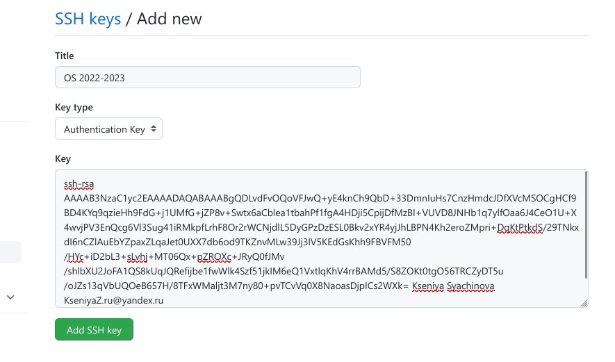

---
## Front matter
lang: ru-RU
title: Лабораторная работа №2
subtitle: "Компюьтерные науки и технология программирования. Операционные системы"
author:
  - Сячинова Ксения Ивановна НММбд-03-22
institute:
  - Российский университет дружбы народов, Москва, Россия
date: 09 февраля 2023

## i18n babel
babel-lang: russian
babel-otherlangs: english

## Formatting pdf
toc: false
toc-title: Содержание
slide_level: 2
aspectratio: 169
section-titles: true
theme: metropolis
header-includes:
 - \metroset{progressbar=frametitle,sectionpage=progressbar,numbering=fraction}
 - '\makeatletter'
 - '\beamer@ignorenonframefalse'
 - '\makeatother'
---

## Цель работы:

Изучить идеологию и применение средств контроля версий git, а также освоить умения по работе с git.

# Выполнение лабораторной работы

## Учётная запись
Для начала нам нужно создать учётную запись на github. Так как в прошлом семестре мы работали с данной платформой, то мы уже зарегестрировались там. 

{#fig:001 width=50%}

## 

Затем произведём базовую настройку git, а именно:
- Зададим имя и email владельца репозитория
- Настроим utf-8 в выводе сообщений git
- Установка параметра autocrlf 
- Установка параметра safecrlf 

{#fig:002 width=50%}

##

После этого создадим ключ для последующей индентификации пользователя на сервере. Делаем это с помощью команды "ssh-keygen -C Имя Фамилия <workemail>".
{#fig:003 width=50%}

##

Командой "cat ~/.ssh/id_rsa.pub | xclip -sel clip" копируем этот ключ и загружаем его на github.

{#fig:004 width=50%}

{#fig:005 width=50%}

##

Далее создадим каталог "Операционные системы" в ранее созданом пространстве. Наш каталог будет иметь путь: work/study/2022-2023/"Операционные системы".

{#fig:006 width=50%}

##

Создаём репозиторий, который будет создан на основе данного нам шаблона. 

{#fig:007 width=50%}

{#fig:008 width=35%}

##

Затем клонируем репозиторий. Для этогокопируем ссылку созданного репозитория (Code -> SSH) и с помощью команды "git clone --recursive" клонируем..

{#fig:009 width=40%}

##

{#fig:010 width=40%}

##

Настроим каталог курса, где удалим ненужные файлы, создадим необходимые каталоги и отправим файл на сервер.
 
{#fig:011 width=50%}

##

Всё выполненно корректно. Мы создали рабочее пространство для выполнения дальнейших лабораторных работ. 

{#fig:012 width=50%}

# Выводы

В процессе выполнения данной лабораторной работы я создала рабочее пространство для дальнейшей работы. Так же вспомнила идеологию и средства контроля версий git.
