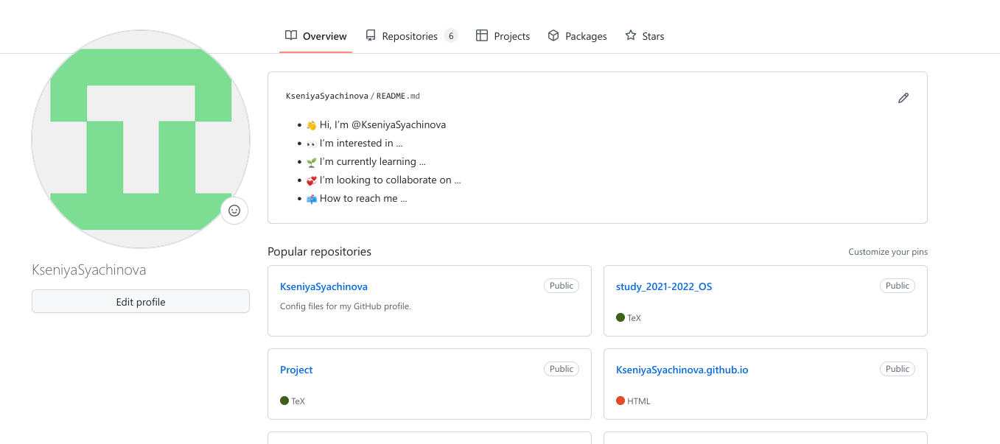
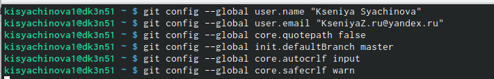
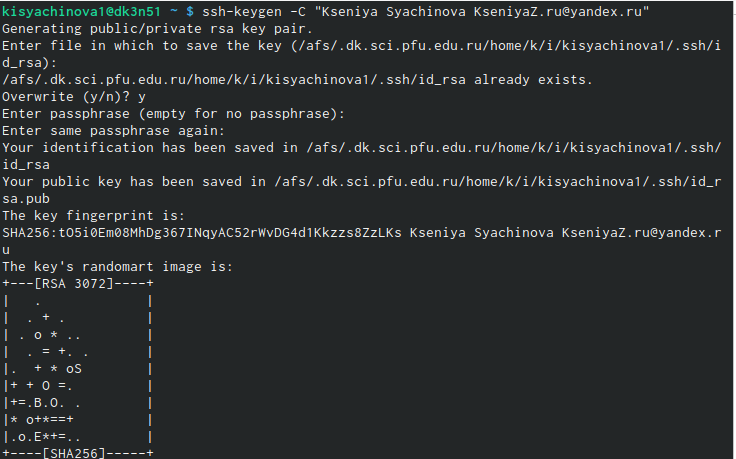
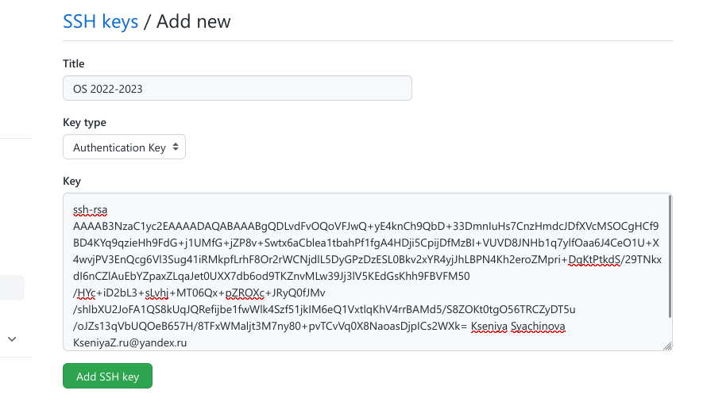
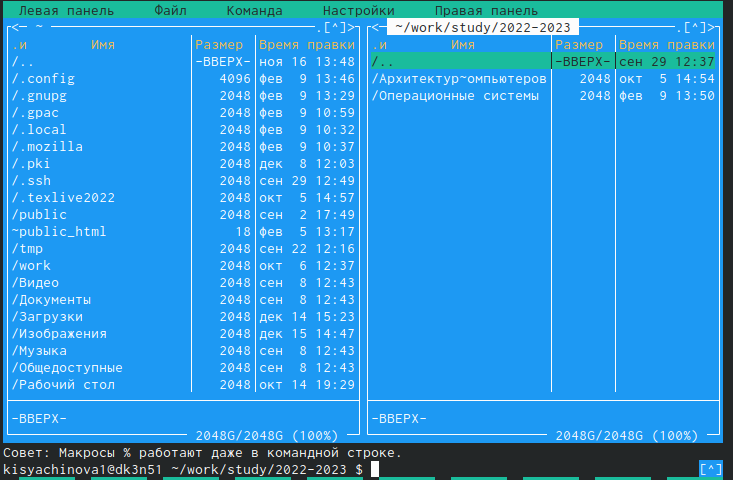
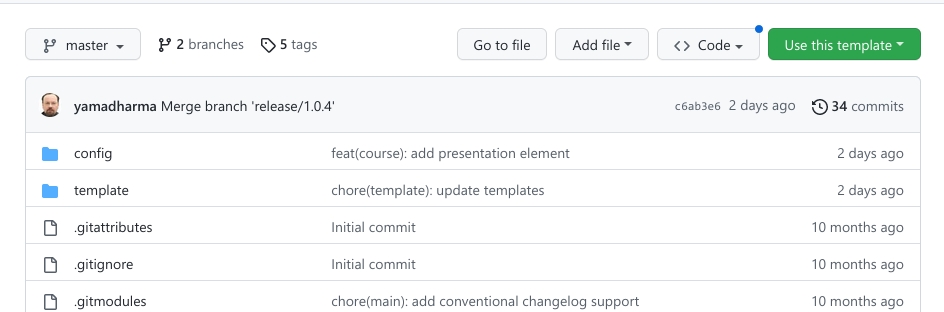
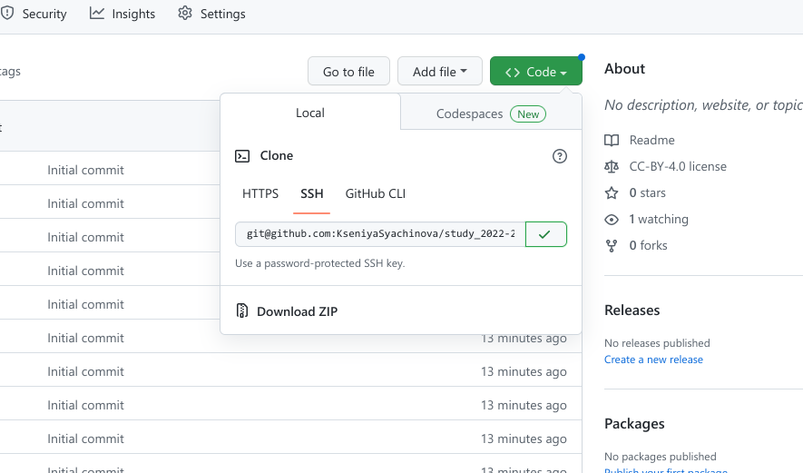
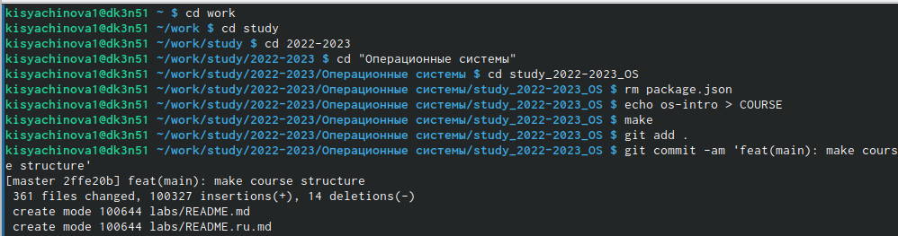
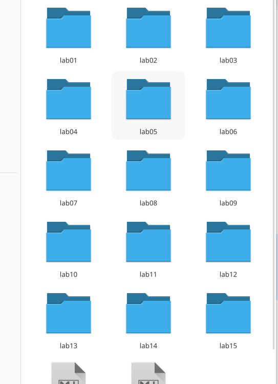

---
## Front matter
title: "Лабораторная работа №2"
subtitle: "Компюьтерные науки и технология программирования. Операционные системы"
author: "Сячинова Ксения Ивановна"

## Generic otions
lang: ru-RU
toc-title: "Содержание"

## Bibliography
bibliography: bib/cite.bib
csl: pandoc/csl/gost-r-7-0-5-2008-numeric.csl

## Pdf output format
toc: true # Table of contents
toc-depth: 2
lof: true # List of figures
lot: true # List of tables
fontsize: 12pt
linestretch: 1.5
papersize: a4
documentclass: scrreprt
## I18n polyglossia
polyglossia-lang:
  name: russian
  options:
	- spelling=modern
	- babelshorthands=true
polyglossia-otherlangs:
  name: english
## I18n babel
babel-lang: russian
babel-otherlangs: english
## Fonts
mainfont: PT Serif
romanfont: PT Serif
sansfont: PT Sans
monofont: PT Mono
mainfontoptions: Ligatures=TeX
romanfontoptions: Ligatures=TeX
sansfontoptions: Ligatures=TeX,Scale=MatchLowercase
monofontoptions: Scale=MatchLowercase,Scale=0.9
## Biblatex
biblatex: true
biblio-style: "gost-numeric"
biblatexoptions:
  - parentracker=true
  - backend=biber
  - hyperref=auto
  - language=auto
  - autolang=other*
  - citestyle=gost-numeric
## Pandoc-crossref LaTeX customization
figureTitle: "Рис."
tableTitle: "Таблица"
listingTitle: "Листинг"
lofTitle: "Список иллюстраций"
lotTitle: "Список таблиц"
lolTitle: "Листинги"
## Misc options
indent: true
header-includes:
  - \usepackage{indentfirst}
  - \usepackage{float} # keep figures where there are in the text
  - \floatplacement{figure}{H} # keep figures where there are in the text
---

# Цель работы

Изучить идеологию и применение средств контроля версий git, а также освоить умения по работе с git.

# Выполнение лабораторной работы

1. Для начала нам нужно создать учётную запись на github. Так как в прошлом семестре мы работали с данной платформой, то мы уже зарегестрировались там. (рис. @fig:001).

{#fig:001 width=50%}

2. Затем произведём базовую настройку git, а именно:
- Зададим имя и email владельца репозитория
- Настроим utf-8 в выводе сообщений git
- Установка параметра autocrlf 
- Установка параметра safecrlf (рис. @fig:002).

{#fig:002 width=50%}

3. После этого создадим ключ для последующей индентификации пользователя на сервере. Делаем это с помощью команды "ssh-keygen -C Имя Фамилия <workemail>".(рис. @fig:003).

{#fig:003 width=50%}

4. Командой "cat ~/.ssh/id_rsa.pub | xclip -sel clip" копируем этот ключ и загружаем его на github.(рис. @fig:004)., (рис. @fig:005).

{#fig:004 width=50%}

{#fig:005 width=50%}

5. Далее создадим каталог "Операционные системы" в ранее созданом пространстве. Наш каталог будет иметь путь: work/study/2022-2023/"Операционные системы".(рис. @fig:006).

{#fig:006 width=50%}

6. Создаём репозиторий, который будет создан на основе данного нам шаблона. (рис. @fig:007), (рис. @fig:008).

{#fig:007 width=50%}

{#fig:008 width=50%}

7. Затем клонируем репозиторий. Для этогокопируем ссылку созданного репозитория (Code -> SSH) и с помощью команды "git clone --recursive" клонируем. (рис. @fig:009),(рис. @fig:010).

{#fig:009 width=50%}

{#fig:010 width=50%}

8. Настроим каталог курса, где удалим ненужные файлы, создадим необходимые каталоги и отправим файл на сервер.(рис. @fig:011).
 
{#fig:011 width=50%}

9. Всё выполненно корректно. Мы создали рабочее пространство для выполнения дальнейших лабораторных работ. (рис. @fig:012).

{#fig:012 width=50%}

# Выводы

В процессе выполнения данной лабораторной работы я создала рабочее пространство для дальнейшей работы. Так же вспомнила идеологию и средства контроля версий git.

# Ответы на контрольные вопросы
1. Контроль версий, также известный как управление исходным кодом, — это практика отслеживания изменений программного кода и управления ими. Системы контроля версий — это программные инструменты, помогающие командам разработчиков управлять изменениями в исходном коде с течением времени.
Какие задачи решает система контроля версий:
- Защищает исходный код от потери. Данные хранятся на удалённом сервере, даже если разработчики удалят файлы с локального компьютера, они останутся в репозитории.
- Обеспечивает командную работу.
- Помогает отменить изменения. 
- Распределённая работа.

2. 
- Хранилище (repository, сокр. repo), или репозитарий, — место хранения всех версий и служебной информации. 
- Коммит (commit; редко переводится как «слепок») — 1) синоним версии; 2) создание новой версии («сделать коммит», «закоммитить»). 
- Рабочая копия (working copy или working tree) — текущее состояние файлов проекта, основанное на версии из хранилища (обычно на последней)

3. Централизованные системы — это системы, которые используют архитектуру клиент / сервер, где один или несколько клиентских узлов напрямую подключены к центральному серверу. Пример - Wikipedia.
В децентрализованных системах каждый узел принимает свое собственное решение. Конечное поведение системы является совокупностью решений отдельных узлов. Пример — Bitcoin.
В классических системах контроля версий используется централизованная модель, предполагающая наличие единого репозитория для хранения файлов.Выполнение большинства функций по управлению версиями осуществляется специальным сервером

4. Создадим локальный репозиторий. Сначала сделаем предварительную конфигурацию, указав имя и email владельца репозитория: git config --global user.name"Имя Фамилия" 
git config --global user.email"work@mail"
и настроив utf-8 в выводе сообщений git: git config --global quotepath false
Для инициализации локального репозитория, расположенного, например, в каталоге ~/tutorial, необходимо ввести в командной строке:
сd
mkdir tutorial
cd tutorial
git init

5. Для последующей идентификации пользователя на сервере репозиториев необходимо сгенерировать пару ключей (приватный и открытый): ssh-keygen -C"Имя Фамилия <work@mail>"
Ключи сохраняться в каталоге~/.ssh/.
Скопировав из локальной консоли ключ в буфер обмена
сat ~/.ssh/id_rsa.pub | xclip -sel clip
вставляем ключ в появившееся на сайте поле.

6. У Git две основных задачи: первая — хранить информацию о всех изменениях в вашем коде, начиная с самой первой строчки, а вторая — обеспечение удобства командной работы над кодом.

7. Наиболее часто используемые команды
- git: – создание основного дерева репозитория:
- git init–получение обновлений (изменений)текущего дерева из центрального репозитория:
- git pull–отправка всех произведённых изменений локального дерева в центральный репози-торий:
- git push–просмотр списка изменённых файлов втекущей директории:git status–просмотртекущих изменения:
- git diff–сохранениетекущих изменений:–добавить все изменённые и/или созданные файлы и/или каталоги:
- git add .–добавить конкретные изменённые и/или созданные файлы и/или каталоги:
- git add имена_файлов – удалить файл и/или каталог из индекса репозитория (приэтомфайл и/илик аталог остаётся в локальной директории): 
- git rm имена_файлов – сохранение добавленных изменений: – сохранить все добавленные изменения и все изменённые файлы: 
- git commit -am 'Описание коммита'–сохранить добавленные изменения с внесением комментария через встроенный редактор:
- git commit–создание новой ветки, базирующейся натекущей: 
- git checkout -b имя_ветки–переключение на некоторую ветку: 
- git checkout имя_ветки (при переключении на ветку, которой ещё нет в локальном репозитории, она будет создана и связана с удалённой) – отправка изменений конкретной ветки в центральный репозиторий: 
- git push origin имя_ветки–слияние ветки стекущим деревом:
- git merge --no-ff имя_ветки–удаление ветки: – удаление локальной уже слитой с основным деревом ветки:
- git branch -d имя_ветки–принудительное удаление локальной ветки:
- git branch -D имя_ветки–удаление ветки с центрального репозитория: 
- git push origin :имя_ветки

8. Использования git при работе с локальными репозиториями (добавления текстового документа в локальный репозиторий):
git add hello.txt
git commit -am'Новый файл

9. Ветки очень облегчают работу. Они решить такие проблемы как:
нужно постоянно создавать архивы с рабочим кодом
сложно "переключаться" между архивами
сложно перетаскивать изменения между архивами
легко что-то напутать или потерять

10. Во время работы над проектом так или иначе могут создаваться файлы, которые не требуется добавлять в последствии в репозиторий. Например, временные файлы, создаваемые редакторами, или объектные файлы, создаваемые компиляторами. Можно прописать шаблоны игнорируемых при добавлении в репозиторий типов файлов в файл. gitignore с помощью сервисов. Для этого сначала нужно получить список имеющихся шаблонов: curl -L -s https://www.gitignore.io/api/list
Затем скачать шаблон,например, для C и C++
curl -L -s https://www.gitignore.io/api/c >> .gitignore
curl -L -s https://www.gitignore.io/api/c++ >> .gitignore
