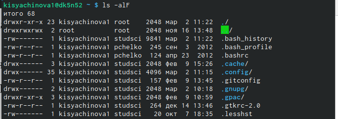
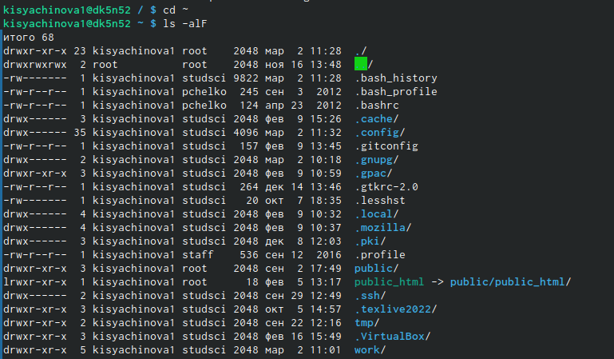

---
## Front matter
lang: ru-RU
title: Презентация по лабораторной работе №4
subtitle: Операционные системы
author:
  - Сячинова Ксения Ивановна
institute:
  - Российский университет дружбы народов, Москва, Россия
  - НММбд-03-22
date: 03 марта 2022

## i18n babel
babel-lang: russian
babel-otherlangs: english

## Formatting pdf
toc: false
toc-title: Содержание
slide_level: 2
aspectratio: 169
section-titles: true
theme: metropolis
header-includes:
 - \metroset{progressbar=frametitle,sectionpage=progressbar,numbering=fraction}
 - '\makeatletter'
 - '\beamer@ignorenonframefalse'
 - '\makeatother'
---

# Цель работы

Приобретение практических навыков взаимодействия пользователя с системой посредством командной строки. 

## Выполнение лабораторной работы

1. Для определения полного имени домашнего каталога мы используем команду *pwd*. 

{#fig:001 width=70%}

##

2. Выполняем второй пункт лабораторной работы.

2.1. Переходим в каталог */tmp*.

2.2. Выводим на экран содержимое каталога */tmp*. Для этого используем команду *ls*. При этом изспользуем разные опции, а именно: 

- "ls" - выводится список каталогов и файлов, которые можно увидеть,"вручную" открыв каталог tmp.

{#fig:002 width=40%}

##

- "ls -a" - к списку, описанному выше, добавляются скрытые каталоги и файлы 

{#fig:003 width=40%}

##

- "ls -F" - с помощью данной команды получаем информацию о типах файла. 

{#fig:004 width=40%}

##

- "ls -l" - получаем список файлов, но уже с более подробной ифнормацией о них

{#fig:005 width=40%}

##

- "ls -alF" - данна команда отображает список всех каталогов и файлов, в том числе и скрытых, с подробной информацией о них.

{#fig:006 width=40%}

##

2.3.Чтобы определить есть ли в каталоге */var/spool* подкаталог с именем *corn*, нужно перейти в указанный катаолог и просмотреть его содержимое. Каталог существует. 

{#fig:007 width=40%}

##

2.4. Затем переходим в домашний каталог и используя команду *ls -alF* можем увидеть, что владельцем всех каталогом и файлов, кроме родительского каталога, является kisyachinova1. 

{#fig:008 width=40%}

##

3. Выполняем следующие действия

3.1. В домашнем каталоге создаём новый каталог *newdir*. Это можно сжедать с помощью команды *mkdir*. Командой *ls* проверяем наличие каталога.

3.2. Затем создаём подкаталог. Для этого переходим в каталог и создаём новый *morefun*. Командой *ls* проверяем выполнение действий. 

{#fig:009 width=40%}

##

3.3. В домашнем каталоге создаём однйо командой три новых каталога с именами *letter, memos, misk*, а затем удаляем их одной командой *rm -r "название файлов"*. 

{#fig:010 width=40%}

##

3.4-3.5. Попробуем удалить каталог *newdir* командой *rm*, но получаем отказ, так как в нём есть подкаталог. Тогда уадаляем его с помощью команды *rm -r newdir/morefun*. Командой *ls* проверяем выполнение. Был удалён подкаталог. 

{#fig:011 width=40%}

##

4. Используя комнаду *man ls* определяем опцию команды, которую необхожимо использовать, что посмотреть сожержимое не только указанного каталога, но и подкаталогов, входящих в него. 

{#fig:012 width=40%}

{#fig:013 width=40%}

##

5. Используя тоже руководство, которые мы открыли с помощью *man ls* мы можем увидеть опции команды, которые позволяют отсортировать по времени последнего изменения выводимый список содержимого каталога с развёрнутым описанием фалов. 

{#fig:014 width=40%}

{#fig:015 width=40%}

{#fig:016 width=40%}

##

6. Используем команду *man* для просмотра описания следующих команд: .

{#fig:017 width=40%}

##

- cd, с помощью команды cd (change directory) можно перемещаться по дереву каталогов. Для этой команды необходим один параметр — целевой каталог. Можно использовать относительный путь (относительно текущего каталога) и абсолютный (относительно корня).

- pwd

-L, --logical - брать директорию из переменной окружения, даже если она содержит символические ссылки;

-P - отбрасывать все символические ссылки;

--help - отобразить справку по утилите;

--version - отобразить версию утилиты.

##

- mkdir

–mode=MODEустанавливает права доступа для создаваемой директории. Синтаксис MODE такой же как у команды chmod;

-p,–parents создать все директории, которые указаны внутри пути. Если
какая-либо директория существует, то предупреждение об этом не выводится;

-v, –verbose выводить сообщение о каждой создаваемой директории; 

-z установить контекст SELinux для создаваемой директории по умолчанию;

–context[=CTX]установить контекст SELinux для создаваемой директории в
значение CTX;

–help показать справку по команде mkdir;

–version показать версию утилиты mkdir

##

- rmdir 

–ignore-fail-on-non-emptyигнорировать директории, которые содержат в себе файлы;

-p, –parentsв этой опции каждый аргумент каталога обрабатывается как путь, из которого будут удалены все компоненты, если они
уже пусты, начиная с последнего компонента;

-v, –verboseотображение подробной информациидля каждого обрабатываемого каталога; 

-–helpпоказать справку по команде rmdir; 

–version показать версию утилиты rmdir

##

- rm

-f, –force игнорировать несуществующие файлы и аргументы.Никогда не выдавать запросы на подтверждение удаления;

-iвыводить запрос на подтверждение удаления каждого файла; 

-I выдать один запрос на подтвержде-ние удаления всех файлов, если удаляется больше трех файлов или используется рекурсивное удаление. Опция применяется, как более «щадящая» версия опции

–i; - –interactive[=WHEN]вместо WHEN можно использовать:never —никогда не выдавать запросы на подтверждение удаления.once —выводить запрос один раз (аналог опции -I). 
always —выводить запрос всегда (аналог опции -i).Если
значение КОГДА не задано, то используется always; 

–one-file-systemво время рекурсивного удаления пропускать директории, которые находятся на других файловых системах;

–no-preserve-rootесли в качестве директории для удаления задан корневой раздел /, то считать, что это обычная директория и начать вы-
полнять удаление; 

–preserve-root[=all]если в качестве директории для удаления
задан корневой раздел /, то запретить выполнять команду rm над корневым
разделом. Данное поведение используется по умолчанию; 

-r, -R, –recursive уда-
ление директорий и их содержимого. Рекурсивное удаление; 

-d, –dir удалятьпустые директории; 

-v, –verbose выводитьинформацию об удаляемых файлах;

–helpпоказать справку по команде rm;

–versionпоказать версию утилиты rm

##

7. Выведем историю с помощью команды “history”. Далее использую команду
*475!:s/morefun/morefun01* и *!491* выполним команды 475 и 491. В 475
будет создан новый каталог morefun01 вместо morefun.

{#fig:018 width=40%}

{#fig:019 width=40%}

# Выводы

В ходе выполнения данной лабораторной работы я приобрела практические навыки по взаимодейсвтию с системой посредством командной строки. 
