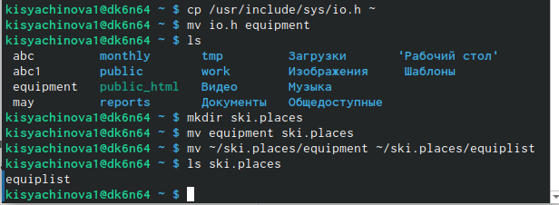
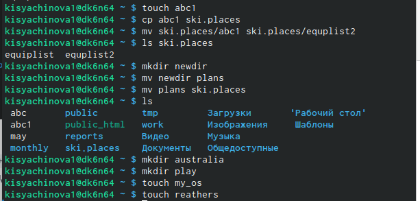
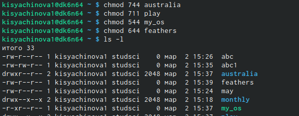
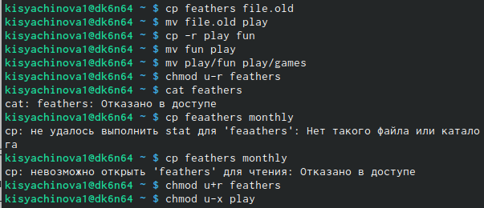
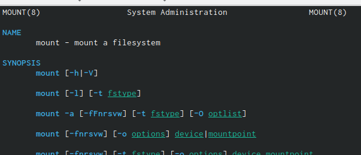
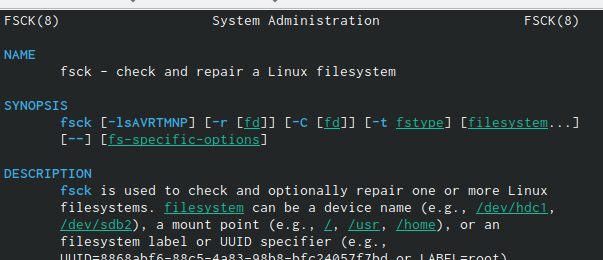
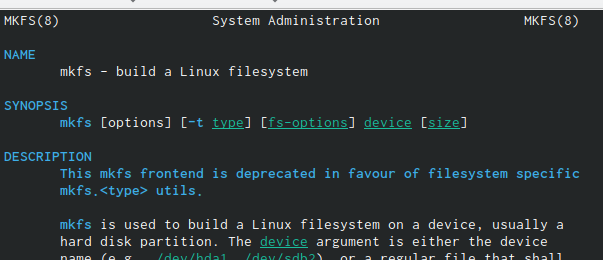
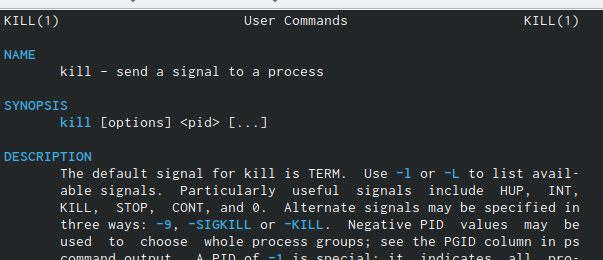

---
## Front matter
lang: ru-RU
title: Презентацияпо лабораторной работе №5
subtitle: Операционные системы
author:
  - Сячинова Ксения Ивановна, НММбд-03-22
institute:
  - Российский университет дружбы народов, Москва, Россия
date: 02 марта 2023

## i18n babel
babel-lang: russian
babel-otherlangs: english

## Formatting pdf
toc: false
toc-title: Содержание
slide_level: 2
aspectratio: 169
section-titles: true
theme: metropolis
header-includes:
 - \metroset{progressbar=frametitle,sectionpage=progressbar,numbering=fraction}
 - '\makeatletter'
 - '\beamer@ignorenonframefalse'
 - '\makeatother'
---

# Цель работы

Ознакомление с файловой системой Linux, её структурой, именами и
содержанием каталогов. Приобретение практических навыков по применению команд для работы с файлами и каталогами, по управлению процессами (и работами), по проверке использования диска и обслуживанию файловой системы.

## Выполнение лабораторной работы

1. Выполним дейсвтия, которые описаны в первой части лабораторной работы. 

- Скопируем файл abc1 в файл april и в файл may. Для этого создадим файл abc1, используя команду «touchabc1», далее осуществим копирование с помощью команд «cpabc1 april» и «cpabc1 may».

- Скопируем файлы april и may в каталогmonthly, используя команды «mkdirmonthly» − для создания каталога monthlyи «cpaprilmaymonthly» − для копирования.

- Скопируем файл monthly/may в файл с именем june. Выполнимкоманды«cpmonthly/maymonthly/june»и«lsmonthly» (для просмотра содержимого каталога).

## 

- Скопируемкаталог monthly в каталог monthly.00. Для этого создадим каталог monthly.00 командой «mkdirmonthly.00»и осуществим копирование, используя команду «cp-rmonthlymonthly.00»(команда cp с опцией r (recursive) позволяет копировать каталоги вместе с входящими в них файлами и каталогами).

- Скопируем каталог monthly.00 в каталог /tmp, используя команду «cp -r monthly.00 /tmp».

{#fig:001 width=40%}

##

- Изменим название файла april на july в домашнем каталоге, используя команду «mv april july».

- Переместим файл july в каталог monthly.00 с помощью команды «mvjulymonthly.00». Проверим результат командой «lsmonthly.00».

- Переименуем каталог monthly.00 в monthly.01, используя команду «mv monthly.00 monthly.01».

- Переместимкаталог monthly.01в каталог reports. Для этого создадим каталог reportsс помощью команды «mkdir reports» и выполним перемещение командой «mv monthly.01 reports».

- Переименуемкаталогreports/monthly.01 вreports/monthly командой «mv reports/monthly.01 reports/monthly»

##

{#fig:002 width=40%}

##

- создадимфайл ~/may с правом выполнения для владельца. Для этого выполним следующие команды:«touchmay» (создание файла), «ls-l may» (просмотр сведений о файле), «chmod u+x may» (изменение прав), «ls-l may».

- лишаем владельца файла ~/may права на выполнение, используя команды: «chmod u-x may» (изменение прав), «ls -l may» (просмотр сведений о файле)

- Создаем каталог monthly с запретом на чтение для членов группы и всех остальных пользователей. Выполняем команды: «mkdir monthly»(создание каталога), «chmod g/o-r monthly»(изменение прав).

- Создаем файл ~/abc1 с правом записи для членов группы, используя команды: «touch abc1» (создание файла), «chmodg+w abc1» (изменение прав)

##

{#fig:003 width=40%}

##

2. 2.1-2.8. 

- Копируем файл /usr/include/aio.hв домашний каталог (команда «cp /usr/include/io.h ~») и назоваем его equipment (команда «mv io.h equipment»).

- В домашнем каталоге создаем директорию ~/ski.plases (команда «mkdir ski.plases»).
Перемещаем файл equipment в каталог ~/ski.plases (команда «mv equipment ski.plases»).

- Переименовываем файл ~/ski.plases/equipment в ~/ski.plases/equiplist (команда «mv ski.plases/equipment ski.plases/equiplist»).

- Создаем в домашнем каталоге файл abc1 (команда «touch abc1») и копируем его в каталог ~/ski.plases (команда «cp abc1 ski.plases»), называем его equiplist2 (команда «mv ski.plases/abc1 ski.plases/equiplist2»).

- Создаем каталог с именем equipment в каталоге ~/ski.plases (команда «mkdir ski.plases/equipment»).

##

- Перемещаем файлы ~/ski.plases/equiplist и equiplist2 в каталог ~/ski.plases/equipment (команда «mv ski.plases/equiolist ski.plases/equiplist2 ski.plases/equipment»).

- Создаем (команда «mkdir newdir») и перемещаем каталог ~/newdir в каталог ~/ski.plases (команда «mv newdir ski.plases») и называем его plans (команда «mv ski.plases/newdir ski.plases/plans»)

{#fig:004 width=40%}

##

3. Определяем опции команды chmod, необходимые для того, чтобы присвоить соответствующим файлам выделенные права доступа, считая, что в начале таких прав нет. Предварительно создаем необходимые файлы, используя команды: «mkdir australia», «mkdir play», «touch my_os», «touch feathers» 

{#fig:005 width=40%}

##

Затем используем команды 

drwxr--r-- ... australia: команда «chmod 744 australia»,

drwx--x--x ... play: команда «chmod 711 play», 

-r-xr--r-- ... my_os: команды «chmod 544 my_os»,

-rw-rw-r-- ... feathers: команды «chmod 664 feathers». 

Командой ls проверяем правильность действий.

{#fig:006 width=40%}

##

4. Затем просмотрим содержимое файла /etc/passwd (команда «cat /etc/passwd»).

{#fig:007 width=40%}

##

- Копируем файл ~/feathers в файл ~/file.old (команда «cp feathers file.old»).

- Переместим файл ~/file.old в каталог ~/play (команда «mv file.ord play»).
Скопируем каталог ~/play в каталог ~/fun (команда «cp -r play fun»).

- Переместим каталог ~/fun в каталог ~/play (команда «mv fun play») и назовем его games (команда «mv play/fun play/games»).

- Лишим владельца файла ~/feathers права на чтение (команда «chmod u-r feathers»).

- Если мы попытаемся просмотреть файл ~/feathers командой cat, то получим отказ в доступе, т.к. в предыдущем пункте лишили владельца права на чтение данного файла.

- Если мы попытаемся скопировать файл ~/feathers, например, в каталог monthly, то получим отказ в доступе, по причине, описанной в предыдущем пункте.

- Дадим владельцу файла ~/feathers право на чтение (команда «chmod u+r feathers»).

- Лишим владельца каталога ~/play права на выполнение (команда «chmod u-x play»).

##

- Перейдем в каталог ~/play (команда «cd play»). 
Получим отказ в доступе, т.к. в предыдущем пункте лишили владельца права на выполнение данного каталога.

- Дадим владельцу каталога ~/play право на выполнение (команда «chmod u+x play»)

{#fig:008 width=40%}

##

5. Используя команды «man mount», «man fsck», «man mkfs», «man kill», получим информацию о соответствующих командах:

- Команда mount: предназначена для монтирования файловой системы. Все файлы, доступные в Unix системах, составляют иерархическую файловую структуру, которая имеет ветки (каталоги) и листья (файлы в каталогах). Корень этого дерева обозначается как /. Физически файлы могут располагаться на различных устройствах. Команда mount служит для подключения файловых систем разных устройств к этому большому дереву. 

{#fig:009 width=40%}

##

- Команда fsck: это утилита командной строки, которая позволяет выполнять проверки согласованности и интерактивное исправление в одной или нескольких файловых системах Linux. Он использует программы, специфичные для типа файловой системы, которую он проверяет. У команды fsck следующий синтаксис: fsck [параметр] -- [параметры ФС] [<файловая система> . . .] Например, если нужно восстановить («починить») файловую систему на некотором устройстве /dev/sdb2, следует воспользоваться командой: «sudo fsck -y /dev/sdb2» 

{#fig:010 width=40%}

##

- Команда mkfs: создаёт новую файловую систему Linux. Имеет следующий синтаксис: mkfs [ -V ] [ -t fstype ] [ fs-options ] filesys [ blocks ] mkfs используется для создания файловой системы Linux на некотором устройстве, обычно в разделе жёсткого диска. В качестве аргумента filesys для файловой системы может выступать или название устройства (например, /dev/hda1, /dev/sdb2) или точка монтирования (например, /, /usr, /home).

{#fig:011 width=40%}

##

- Команда kill: посылает сигнал процессу или выводит список допустимых сигналов. Имеет следующий синтаксис: kill [опции] PID, где PID – это PID (числовой идентификатор) процесса или несколько PID процессов, если требуется послать сигнал сразу нескольким процессам. Например, команда «kill -KILL 3121» посылает сигнал KILL процессу с PID 3121, чтобы принудительно завершить процесс 

{#fig:012 width=40%}

## Вывод 

В ходе выполнения данной лабораторной работы я ознакомилась с файловой системой Linux, её структурой, именами и содержанием каталогов, получила навыки по применению команд для работы с файлами и каталогами, по управлению процессами (и работами), по проверке использования диска и обслуживанию файловой системы.
