---
## Front matter
title: "Шаблон отчёта по лабораторной работе"
subtitle: "Простейший вариант"
author: "Дмитрий Сергеевич Кулябов"

## Generic otions
lang: ru-RU
toc-title: "Содержание"

## Bibliography
bibliography: bib/cite.bib
csl: pandoc/csl/gost-r-7-0-5-2008-numeric.csl

## Pdf output format
toc: true # Table of contents
toc-depth: 2
lof: true # List of figures
lot: true # List of tables
fontsize: 12pt
linestretch: 1.5
papersize: a4
documentclass: scrreprt
## I18n polyglossia
polyglossia-lang:
  name: russian
  options:
	- spelling=modern
	- babelshorthands=true
polyglossia-otherlangs:
  name: english
## I18n babel
babel-lang: russian
babel-otherlangs: english
## Fonts
mainfont: PT Serif
romanfont: PT Serif
sansfont: PT Sans
monofont: PT Mono
mainfontoptions: Ligatures=TeX
romanfontoptions: Ligatures=TeX
sansfontoptions: Ligatures=TeX,Scale=MatchLowercase
monofontoptions: Scale=MatchLowercase,Scale=0.9
## Biblatex
biblatex: true
biblio-style: "gost-numeric"
biblatexoptions:
  - parentracker=true
  - backend=biber
  - hyperref=auto
  - language=auto
  - autolang=other*
  - citestyle=gost-numeric
## Pandoc-crossref LaTeX customization
figureTitle: "Рис."
tableTitle: "Таблица"
listingTitle: "Листинг"
lofTitle: "Список иллюстраций"
lotTitle: "Список таблиц"
lolTitle: "Листинги"
## Misc options
indent: true
header-includes:
  - \usepackage{indentfirst}
  - \usepackage{float} # keep figures where there are in the text
  - \floatplacement{figure}{H} # keep figures where there are in the text
---

# Цель работы

Освоение основных возможностей командной оболочки Midnight Commander.
Приобретение навыков практической работы по просмотру каталогов и файлов;
манипуляций с ними

# Выполнение лабораторной работы

1. **Задание по mc**. Изучаем информацию о mc, вызвав в командной строке man mc.(рис. @fig:001).

{#fig:001 width=70%}

2. Запустим из командной строки mc и изучим его структуру и меню. Видим, что верхнее меню содержит “Левая панель”, “Файл”, “Команда”, “Настройки”, “Правая панель”. Также, начав клавиши F1 и F2 мы можем открыть “Помощь” или “Меню пользователя”.(рис. @fig:002),(рис. @fig:003),(рис. @fig:004).

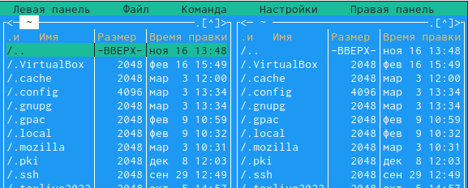{#fig:002 width=70%}

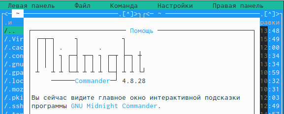{#fig:003 width=70%}

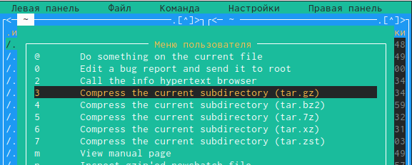{#fig:004 width=70%}

3. Выполним несколько операций в mc. Выделение и отмена выделения файлов. Для этого используем “shift”+стрелку вниз.(рис. @fig:005).

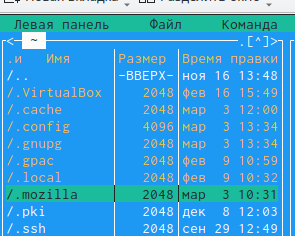{#fig:005 width=70%}

Копирование и перемещение файлов. Для копирования используем клафишу “F5”, а для перемещения “F6”.(рис. @fig:006), (рис. @fig:007).

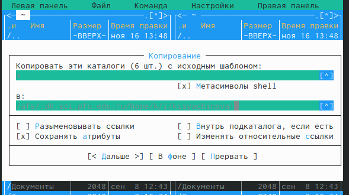{#fig:006 width=70%}

{#fig:007 width=70%}

После этого выполним команду для получения информации о размерах и правах доступа на файлы и/или каталоги. Это делаем таким путём: “Левая панель”-“Информация”.(рис. @fig:008),(рис. @fig:009).

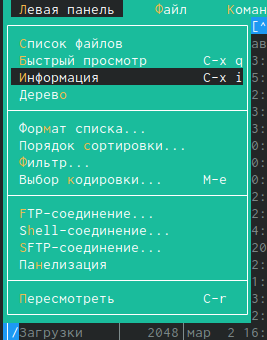{#fig:008 width=70%}

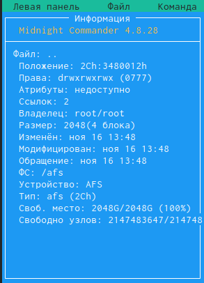{#fig:009 width=70%}

4. Выполним основные команды меню левой панели.(рис. @fig:010)

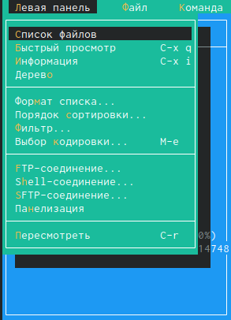{#fig:010 width=70%}

"Список файлов” отображает размер файла и время его правки.(рис. @fig:011)

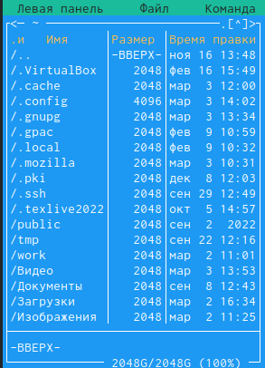{#fig:011 width=70%}

Быстрый просмотр” необходим для просмотра сожержания файлов. Пункт “Информация” отображает подробные данные для о файле.(рис. @fig:012)

{#fig:012 width=70%}

Пункт “Дерево” необходим для просмотра дерева каталога.(рис. @fig:013)

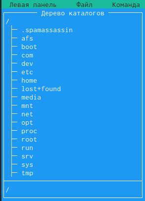{#fig:013 width=70%}

“Формат списка” (рис. @fig:014)

- “Укороченный” отображает только имя файла или каталога.

- “Расширенный” отображает подробную информацию о файлах.

- ”Определённый пользователем” даёт возможность самостоятельно изменять степень подробнотио файле. 

- “Стандартный” ставится по умолчанию. 

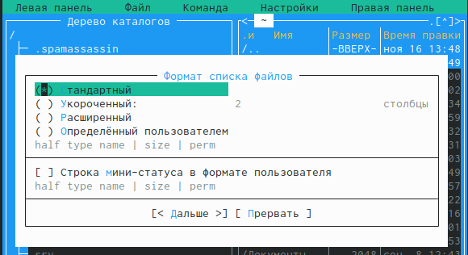{#fig:014 width=70%}

Пункт “Фильтр” необходим для того, чтобы просмотреть название файлов
или каталогов, которые подходят под указанную маску.

“Порядок сортировки” необходим для сортировки файлов ил каталогов по конкретному критерию.

5. С помощью фозможностей подменю “Файл” выполним следующие действия. (рис. @fig:015)

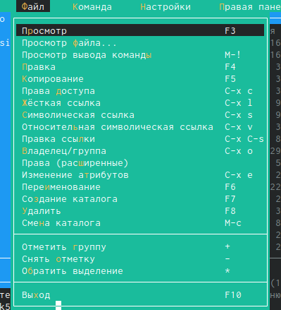{#fig:015 width=70%}

Для просмотра содержимого файла выберем пункт “Просмотр файла”. (рис. @fig:016)

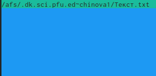{#fig:016 width=70%}

Для редактирования содержимого текстового файла перейдём в пункт “Правка” и изменим на “Hello”(рис. @fig:017)

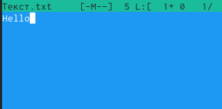{#fig:017 width=70%}

Для создания каталога переходим в пункт “Создание каталога”. Я создам каталог “Hello”(рис. @fig:018)

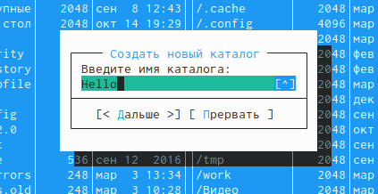{#fig:018 width=70%}

Копирование файлов в созданный каталог происходит с помощью выбора пункта “Копирование”. Выделим несколько файлов и пернесём их в каталог.(рис. @fig:019)

{#fig:019 width=70%}

6. С помощью средств подменю “Команда” осуществим следующие действия:поиск в файловой системе файла с заданными условия. Задаим условия “От каталога /,”Шаблон имени”*.сpp, “Содержимое”main. (рис. @fig:020), (рис. @fig:021)

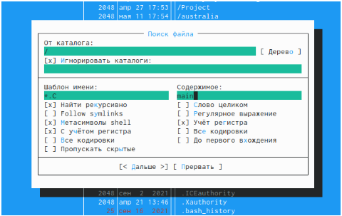{#fig:020 width=70%}

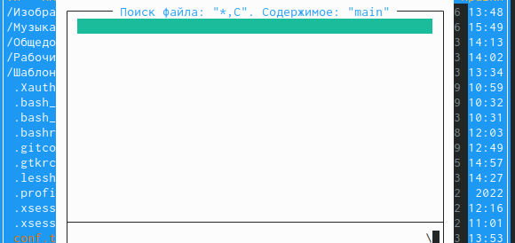{#fig:021 width=70%}

Затем для выбора и повторения одной из предыдущих комнад перейдём в
“История командной строки”-“История” внизу экрана, но это сноска пустая, т.к. не была использована командная строка.(рис. @fig:022)

{#fig:022 width=70%}

Для перехода в домашний каталог переходим в пункт “Дерево каталогов” и выбираем необходимый каталог. (рис. @fig:023)

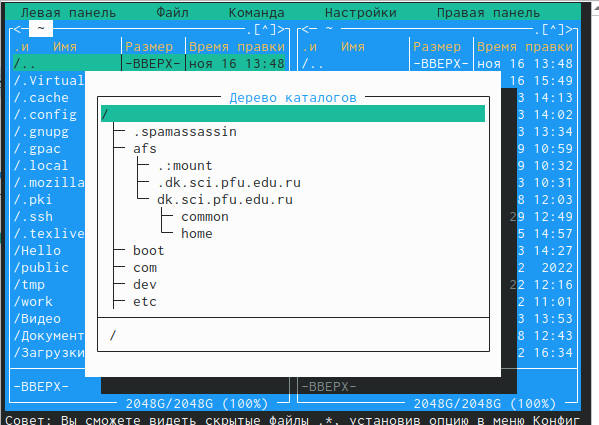{#fig:023 width=70%}

Для анализа файла меню и файла расширение переходим в пункт “Редактировать файл расширений(рис. @fig:024)

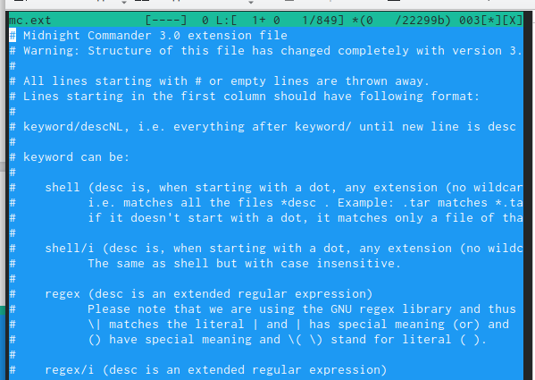{#fig:024 width=70%}

7. Вызовем подменю “Найстройки”. Освоим операции: “Конфигурация” позволяет скорректировать найстройки работы с панелями. “Внешний вид”-
“Настрйока панелей” помогают определить элементы, отображаемые при вызове mc. Пункт “Подтеждение” помогаем установить или убрать вывод окна с хапросом подтверждения действий при операциях удаления и перезаписи файлов. Пунк “Оформление” даёт возможность менять цветовую гамму визуальной оболочки. А с помощью пункта “Сохранить настройки”
сохраняем изменения.(рис. @fig:025)

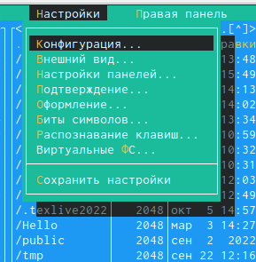{#fig:025 width=70%}

**Задание по встроенному редактору mc**

1. Создаём текстовый файл “text.txt”, командой “ls” проверяем выполнение действий. 

2. Открываем этот файл с помощью встроенного mc редактора с помощью команды “mcedit text.txt”.(рис. @fig:026)

{#fig:026 width=70%}

3. Вставим любой текстиз интернета и сделаем с ним следующие изменения.(рис. @fig:027)

{#fig:027 width=70%}

4. Удалим некую строчку стихотворения с помощью команды “F8”.(рис. @fig:028)

{#fig:028 width=70%}

Выделим фрагмент текста с помощью “F3” и скопируем его на новую строку с помощью клавиши”F5”. (рис. @fig:029)

{#fig:029 width=70%}

Сохраним файл с помощью клавиши “F2”.И отменим последнее действие с
помощью клавиш “ctrl+u”.(рис. @fig:030)

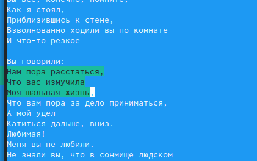{#fig:030 width=70%}

Для перехода в конец файла используем сочетание клавиш “ctrl+end”, и напишем автора стихотворения. (рис. @fig:031)

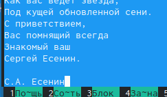{#fig:031 width=70%}

Для перехода в начало испольузем “ctrl+home” и напишем заголовок. (рис. @fig:032)

{#fig:032 width=70%}

Сохраним и выйдем в konsole.

5. Откроем файл с исходным текстом на некотором языке прогроммирования.
Введём команду “find / -name *.java”(рис. @fig:033)

{#fig:033 width=70%}

6. Используя меню редактора “Команда” - ” Отключить панели” мы можем включить/выключить подсветку строки.(рис. @fig:034)

{#fig:034 width=70%}

# Выводы

В процессе выполнения лабораторной работы я освоила основные возможности командной оболочки Midnight Commander.
Приобрила навыки практической работы по просмотру каталогов и файлов; манипуляций с ними

# Ответы на контрольные вопросы

1. Панели могут дополнительно быть переведены в один из двух режимов:
«Информация» или «Дерево». В режиме «Информация» на панель выводятся
сведения о файле и текущей файловой системе, расположенных на активной
панели. В режиме «Дерево» на одной из панелей выводится структура дерева
каталогов.

2. Как с помощью команд shell, так и с помощью меню (комбинаций клавиш)
mc можно выполнить следующие операции с файлами:
• копирование «F5» («cp имя_файла имя_каталога(в который копируем)»)
• перемещение/переименование «F6»(«mv имя_файла имя_каталога(в кото-
рый перемещаем)»
• создание каталога «F7» («mkdir имя_каталога»)
• удаление «F8» («rm имя_файла»)

3. Перейти в строку меню панелей mc можно с помощью функциональной
клавиши «F9». В строке меню имеются пять меню: «Левая панель», «Файл»,
«Команда», «Настройки» и «Правая панель». Подпункт меню «Быстрый про-
смотр» позволяет выполнить быстрый просмотр содержимого панели. Под-
пункт меню «Информация» позволяет посмотреть информацию о файле
или каталоге. В меню каждой (левой или правой) панели можно выбрать
«Формат списка»:
• стандартный − выводит список файлов и каталогов с указанием размера и
времени правки;
• ускоренный − позволяет задать число столбцов, на которые разбивается
панель при выводе списка имён файлов или каталогов без дополнительной
информации;
• расширенный − помимо названия файла или каталога выводит сведения о
правах доступа, владельце, группе, размере, времени правки;
• определённый пользователем − позволяет вывести те сведения о файле
или каталоге, которые задаст сам пользователь. Подпункт меню «Порядок
сортировки» позволяет задать критерии сортировки при выводе списка
файлов и каталогов: без сортировки, по имени, расширенный, время правки,
время доступа, время изменения атрибута, размер, узел.

4. Команды меню «Файл»:
• Просмотр («F3») − позволяет посмотреть содержимое текущего (или выде-
ленного) файла без возможности редактирования.
• Просмотр вывода команды («М» + «!») − функция запроса команды с пара-
метрами (аргумент к текущему выбранному файлу).
• Правка («F4») − открывает текущий (или выделенный) файл для его редак-
тирования.
• Копирование («F5») − осуществляет копирование одного или нескольких
файлов или каталогов в указанное пользователем во всплывающем окне
место.
• Права доступа («Ctrl-x» «c») − позволяет указать (изменить) права доступа к
одному или нескольким файлам или каталогам.
• Жёсткая ссылка («Ctrl-x» «l») − позволяет создать жёсткую ссылку к текущему
(или выделенному) файлу.
• Символическая ссылка («Ctrl-x» «s») − позволяет создать символическую
ссылку к текущему (или выделенному) файлу.
• Владелец/группа («Ctrl-x» «o») − позволяет задать (изменить) владельца и
имя группы для одного или нескольких файлов или каталогов.
• Права (расширенные) − позволяет изменить права доступа и владения для
одного или нескольких файлов или каталогов.
• Переименование («F6») − позволяет переименовать (или переместить) один
или несколько файлов или каталогов.
• Создание каталога («F7») − позволяет создать каталог.
• Удалить («F8») − позволяет удалить один или несколько файлов или катало-
гов.
• Выход («F10») − завершает работу mc.

5. Меню Команда В меню Команда содержатся более общие команды для
работы с mc. Команды меню Команда:
• Дерево каталогов − отображает структуру каталогов системы.
• Поиск файла − выполняет поиск файлов по заданным параметрам.
• Переставить панели − меняет местами левую и правую панели.
• Сравнить каталоги («Ctrl-x» «d») − сравнивает содержимое двух каталогов.
• Размеры каталогов − отображает размер и время изменения каталога (по
умолчанию в mc размер каталога корректно не отображается).
• История командной строки − выводит на экран список ранее выполненных
в оболочке команд.
• Каталоги быстрого доступа ( Ctrl-») − при вызове выполняется быстрая
смена текущего каталога на один из заданного списка.
• Восстановление файлов − позволяет восстановить файлы на файловых си-
стемах ext2 и ext3.
• Редактировать файл расширений − позволяет задать с помощью определён-
ного синтаксиса действия при запуске файлов с определённым расширени-
ем (например, какое программного обеспечение запускать для открытия
или редактирования файлов с расширением doc или docx).
• Редактировать файл меню − позволяет отредактировать контекстное меню
пользователя, вызываемое по клавише «F2».
• Редактировать файл расцветки имён − позволяет подобрать оптимальную
для пользователя расцветку имён файлов в зависимости от их типа.

6. Меню Настройки содержит ряд дополнительных опций по внешнему виду
и функциональности mc. Меню Настройки содержит:
• Конфигурация − позволяет скорректировать настройки работы с панелями.
• Внешний вид и Настройки панелей − определяет элементы (строка меню,
командная строка, подсказки и прочее), отображаемые при вызове mc, а
также геометрию расположения панелей и цветовыделение.
• Биты символов − задаёт формат обработки информации локальным терми-
налом.
• Подтверждение − позволяет установить или убрать вывод окна с запросом
подтверждения действий при операциях удаления и перезаписи файлов, а
также при выходе из программы.
• Распознание клавиш − диалоговое окно используется для тестирования
функциональных клавиш, клавиш управления курсором и прочее.
• Виртуальные ФС − настройки виртуальной файловой системы: тайм-аут,
пароль и прочее.

7. Функциональные клавиши mc:
- F1 – вызов контекстно-зависимой подсказки
- F2 – вызов пользовательского меню с возможностью создания и/или допол-
нения дополнительных функций
- F3 – просмотр содержимого файла, на который указывает подсветка в ак-
тивной панели (без возможности редактирования)
- F4 – вызов встроенного в mc редактора для изменения содержания файла,
на который указывает подсветка в активной панели
- F5 – копирование одного или нескольких файлов, отмеченных
в первой (активной) панели, в каталог, отображаемый на второй панели 
- F6 – перенос одного или нескольких файлов, отмеченных в первой (активной) панели,
в каталог, отображаемый на второй панели 
- F7 – создание подкаталога в каталоге,
отображаемом в активной панели 
- F8 – удаление одного или нескольких файлов
(каталогов), отмеченных в первой (активной) панели файлов 
- F9 – вызов менюmc 
- F10 – выход из mc

8. Встроенный в mc редактор вызывается с помощью функциональной клави-
ши «F4». В нём удобно использовать различные комбинации клавиш при
редактировании содержимого (как правило текстового) файла. Клавиши
для редактирования файла:
• «Ctrl-y» − удалить строку
• «Ctrl-u» − отмена последней операции
• «ins» вставка/замена
• «F7» − поиск (можно использовать регулярные выражения)
• «-F7» − повтор последней операции поиска
• «F4» − замена
• «F3» − первое нажатие − начало выделения, второе − окончание выделения
• «F5» − копировать выделенный фрагмент
• «F6» − переместить выделенный фрагмент
• «F8» − удалить выделенный фрагмент
• «F2» − записать изменения в файл
• «F10» − выйти из редактор

9. Для редактирования меню клавишей «F2», необходимо перейти в пункт
«Редактировать файлменю» «Команда» и изменить настройки файла.

10. Часть команд «Меню пользователя», а также меню «Файл» позволяют вы-
полнять действия, определяемые пользователем, над текущим файлом. На-
пример, копирование каталога или файла, переименование, перемещение,
архивирование.
