---
## Front matter
lang: ru-RU
title: Презентация по лабораторной работе №9
subtitle: Операционные системы
author:
  - Сячинова Ксения Ивановна, НММбд-03-22
institute:
  - Российский университет дружбы народов, Москва, Россия
date: 10 марта 2023

## i18n babel
babel-lang: russian
babel-otherlangs: english

## Formatting pdf
toc: false
toc-title: Содержание
slide_level: 2
aspectratio: 169
section-titles: true
theme: metropolis
header-includes:
 - \metroset{progressbar=frametitle,sectionpage=progressbar,numbering=fraction}
 - '\makeatletter'
 - '\beamer@ignorenonframefalse'
 - '\makeatother'
---

# Цель работы

Познакомиться с операционной системой Linux.Получить практические навыки работы с редактором Emacs.

# Задание

1. Ознакомиться с теоретическим материалом.
2. Ознакомиться с редактором emacs.
3. Выполнить упражнения.
4. Ответить на контрольные вопросы.

# Выполнение лабораторной работы

1. Для работы в “Emacs” необходимо установить его. Открываем его с помощью команды “emacs &” 

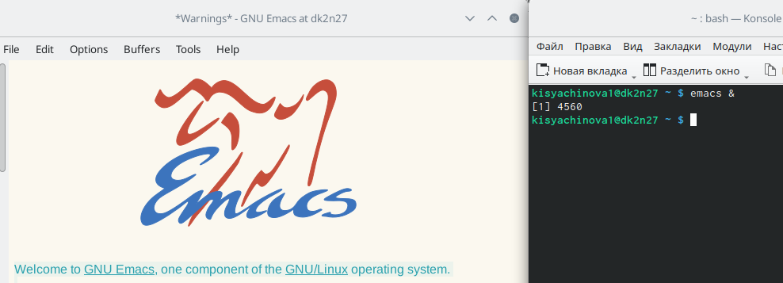{#fig:001 width=30%}

##

2. Создаём файл lab07.sh и с помощью комбинаций “ctrl-x”,“ctrl-f” открываем его.

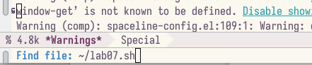{#fig:002 width=30%}

##

3.  Напишем необходимый текст. 

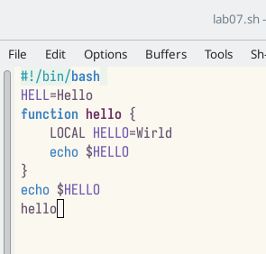{#fig:003 width=30%}

##

4. Сохраняем файл с помощью комбинаций клавиш “ctrl-x”, “ctrl-s”

##

5. Выполним ряд дейсвтий:

- 5.1. Вырезать одной командой целую строку (С-k).

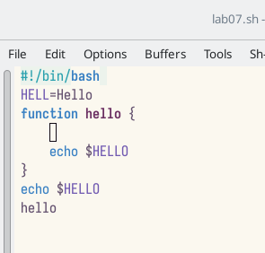{#fig:004 width=30%}

##

- 5.2. Вставить эту строку в конец файла (C-y).

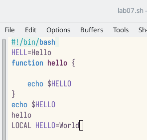{#fig:005 width=30%}

##

- 5.3. Выделить область текста (C-space)

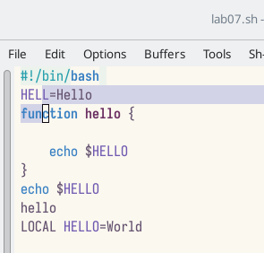{#fig:006 width=30%}

##

- 5.4. Скопировать область в буфер обмена (M-w).

- 5.5. Вставить область в конец файла.

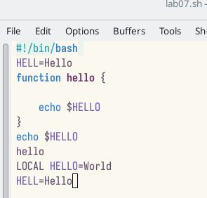{#fig:007 width=30%}

##

- 5.6. Вновь выделить эту область и на этот раз вырезать её (C-w).

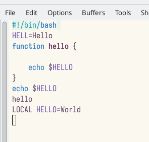{#fig:008 width=30%}

##

- 5.7. Отмените последнее действие (C-/).

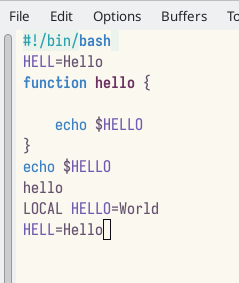{#fig:009 width=30%}

##

6. Действия с курсором

- 6.1. Переместите курсор в начало строки (C-a).

{#fig:010 width=30%}

##

- 6.2. Переместите курсор в конец строки (C-e).

{#fig:011 width=40%}

##

- 6.3. Переместите курсор в начало буфера (M-<).

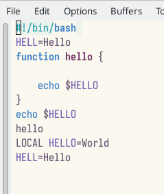{#fig:012 width=30%}

##

- 6.4. Переместите курсор в конец буфера (M->).

{#fig:013 width=30%}

##

7. Управление буферами.

- 7.1. Вывести список активных буферов на экран (C-x C-b).

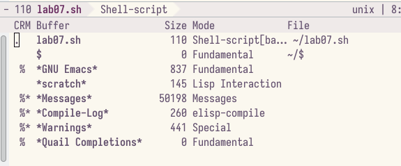{#fig:014 width=30%}

##

- 7.2. Переместим во вновь открытое окно (C-x o) со списком открытых буферов и переключимся на другой буфер (для этого нажмём “enter”)

{#fig:015 width=30%}

##

- 7.3. Закройте это окно (C-x 0).

7.4. Теперь вновь переключайтесь между буферами, но уже без вывода их списка на экран (C-x b).

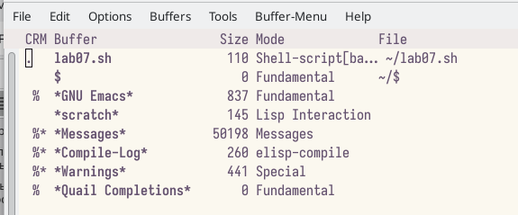{#fig:016 width=30%}

##

8. Управление окнами.

- 8.1. Поделите фрейм на 4 части: разделите фрейм на два окна по вертикали (C-x 3), а затем каждое из этих окон на две части по горизонтали (C-x 2) 

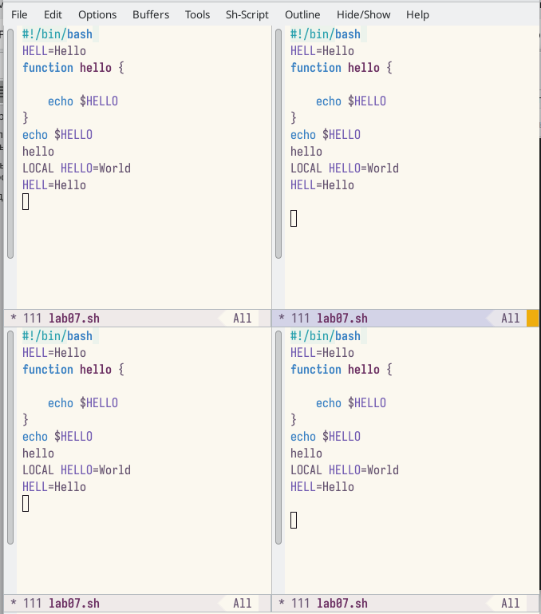{#fig:017 width=30%}

##

- 8.2. В каждом из четырёх созданных окон откроем новый буфер (файл) и введём несколько строк текста. Для этого я заранее создала 4 файла с разным текстом.

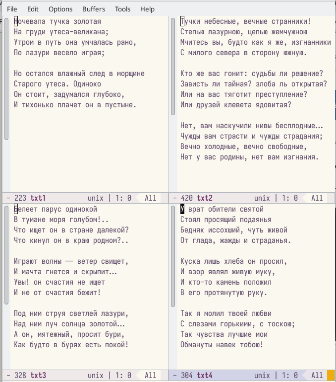{#fig:018 width=30%}

##

9. Режим поиска

- 9.1. Переключитесь в режим поиска (C-s) и найдите несколько слов, присутствующих в тексте.

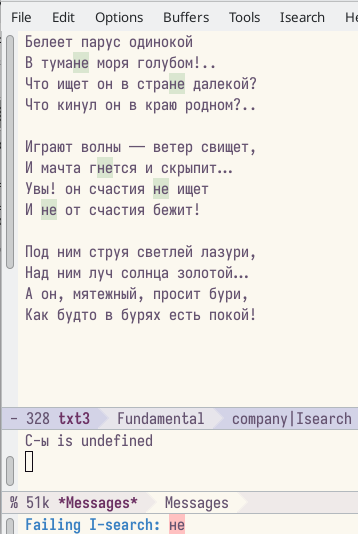{#fig:019 width=30%}

##

- 9.2. Переключайтесь между результатами поиска, нажимая C-s

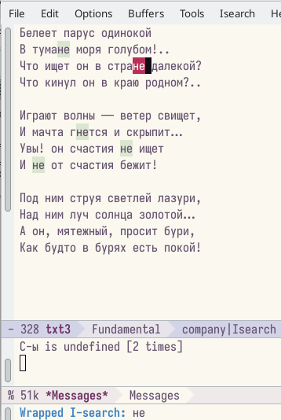{#fig:020 width=30%}

##

- 9.3. Выйдите из режима поиска, нажав C-g.

- 9.4. Перейдите в режим поиска и замены (M-%), введите текст, который следует найти и заменить, нажмите Enter , затем введите текст для замены. После того как будут
подсвечены результаты поиска, нажмите ! для подтверждения замены.

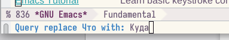{#fig:021 width=30%}

{#fig:022 width=30%}

##

- 9.5. Попрбуем режим поиска (M-s o). Данный поиск отличается тем, что тут считывается строка поиска, которая трактуется как регулярное выражение,
и не осуществляемся поиск точно совпадения в тексте буфера. Регулярное выражение - это образец, который обозначает набор строк, возможно, и неограничнный набор

# Выводы

В ходе выполнения данной лабораторной работы я познакомилась с операционной системой Lunix и получила практические навыки по работе с редактором
Emacs.
