---
## Front matter
title: "Отчёт по лабораторной работе №9"
subtitle: "Операционные системы"
author: "Сячинова Ксения Ивановна"

## Generic otions
lang: ru-RU
toc-title: "Содержание"

## Bibliography
bibliography: bib/cite.bib
csl: pandoc/csl/gost-r-7-0-5-2008-numeric.csl

## Pdf output format
toc: true # Table of contents
toc-depth: 2
lof: true # List of figures
lot: true # List of tables
fontsize: 12pt
linestretch: 1.5
papersize: a4
documentclass: scrreprt
## I18n polyglossia
polyglossia-lang:
  name: russian
  options:
	- spelling=modern
	- babelshorthands=true
polyglossia-otherlangs:
  name: english
## I18n babel
babel-lang: russian
babel-otherlangs: english
## Fonts
mainfont: PT Serif
romanfont: PT Serif
sansfont: PT Sans
monofont: PT Mono
mainfontoptions: Ligatures=TeX
romanfontoptions: Ligatures=TeX
sansfontoptions: Ligatures=TeX,Scale=MatchLowercase
monofontoptions: Scale=MatchLowercase,Scale=0.9
## Biblatex
biblatex: true
biblio-style: "gost-numeric"
biblatexoptions:
  - parentracker=true
  - backend=biber
  - hyperref=auto
  - language=auto
  - autolang=other*
  - citestyle=gost-numeric
## Pandoc-crossref LaTeX customization
figureTitle: "Рис."
tableTitle: "Таблица"
listingTitle: "Листинг"
lofTitle: "Список иллюстраций"
lotTitle: "Список таблиц"
lolTitle: "Листинги"
## Misc options
indent: true
header-includes:
  - \usepackage{indentfirst}
  - \usepackage{float} # keep figures where there are in the text
  - \floatplacement{figure}{H} # keep figures where there are in the text
---

# Цель работы

Познакомиться с операционной системой Linux.Получить практические навыки работы с редактором Emacs.

# Задание

1. Ознакомиться с теоретическим материалом.
2. Ознакомиться с редактором emacs.
3. Выполнить упражнения.
4. Ответить на контрольные вопросы.

# Выполнение лабораторной работы

1. Для работы в “Emacs” необходимо установить его. Открываем его с помощью команды “emacs &” (рис. @fig:001).

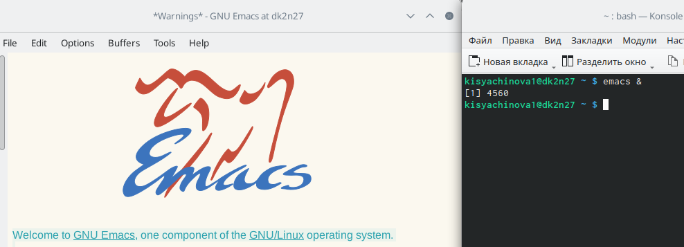{#fig:001 width=40%}

2. Создаём файл lab07.sh и с помощью комбинаций “ctrl-x”,“ctrl-f” открываем его.(рис. @fig:002).

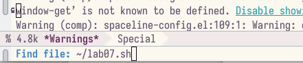{#fig:002 width=40%}

3.  Напишем необходимый текст. (рис. @fig:003).

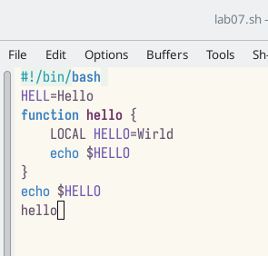{#fig:003 width=40%}

4. Сохраняем файл с помощью комбинаций клавиш “ctrl-x”, “ctrl-s”

5. Выполним ряд дейсвтий:

- 5.1. Вырезать одной командой целую строку (С-k).(рис. @fig:004).

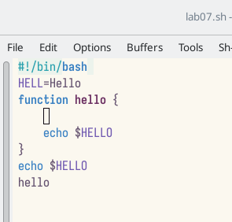{#fig:004 width=40%}

- 5.2. Вставить эту строку в конец файла (C-y).(рис. @fig:005).

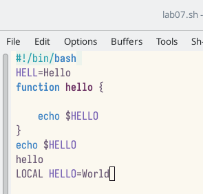{#fig:005 width=40%}

- 5.3. Выделить область текста (C-space).(рис. @fig:006).

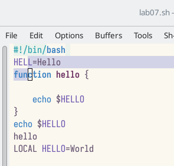{#fig:006 width=40%}

- 5.4. Скопировать область в буфер обмена (M-w).

- 5.5. Вставить область в конец файла.(рис. @fig:007)

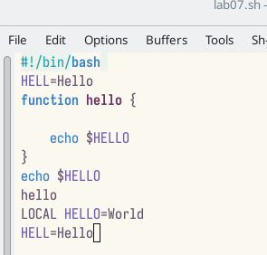{#fig:007 width=40%}

- 5.6. Вновь выделить эту область и на этот раз вырезать её (C-w).(рис. @fig:008)

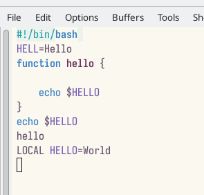{#fig:008 width=40%}

- 5.7. Отмените последнее действие (C-/).(рис. @fig:009)

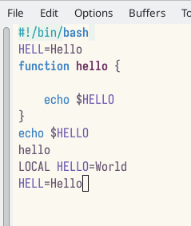{#fig:009 width=40%}

6. Действия с курсором

- 6.1. Переместите курсор в начало строки (C-a).(рис. @fig:010)

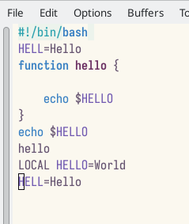{#fig:010 width=40%}

- 6.2. Переместите курсор в конец строки (C-e).(рис. @fig:011)

{#fig:011 width=40%}

- 6.3. Переместите курсор в начало буфера (M-<).(рис. @fig:012)

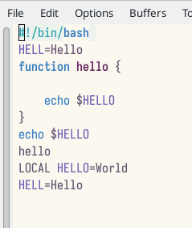{#fig:012 width=40%}

- 6.4. Переместите курсор в конец буфера (M->).(рис. @fig:013)

{#fig:013 width=40%}

7. Управление буферами.

- 7.1. Вывести список активных буферов на экран (C-x C-b).(рис. @fig:014)

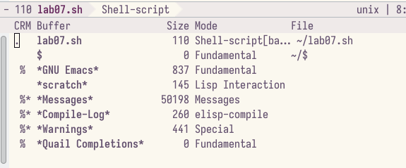{#fig:014 width=40%}

- 7.2. Переместим во вновь открытое окно (C-x o) со списком открытых буферов и переключимся на другой буфер (для этого нажмём “enter”)(рис. @fig:015)

{#fig:015 width=40%}

- 7.3. Закройте это окно (C-x 0).

7.4. Теперь вновь переключайтесь между буферами, но уже без вывода их списка на экран (C-x b).

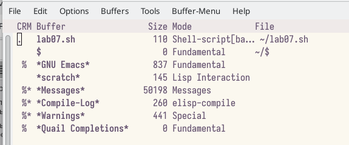{#fig:016 width=40%}

8. Управление окнами.

- 8.1. Поделите фрейм на 4 части: разделите фрейм на два окна по вертикали (C-x 3), а затем каждое из этих окон на две части по горизонтали (C-x 2) (рис. @fig:017)

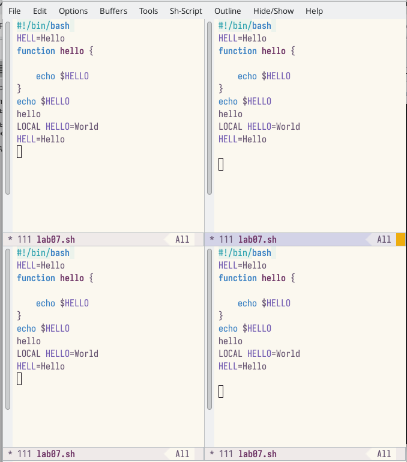{#fig:017 width=40%}

- 8.2. В каждом из четырёх созданных окон откроем новый буфер (файл) и введём несколько строк текста. Для этого я заранее создала 4 файла с разным текстом.(рис. @fig:018)

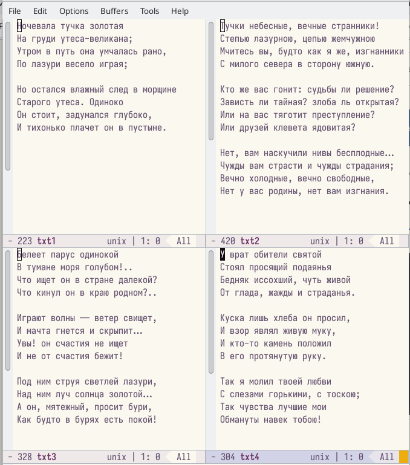{#fig:018 width=40%}

9. Режим поиска

- 9.1. Переключитесь в режим поиска (C-s) и найдите несколько слов, присутствующих в тексте.(рис. @fig:019)

{#fig:019 width=40%}

- 9.2. Переключайтесь между результатами поиска, нажимая C-s(рис. @fig:020)

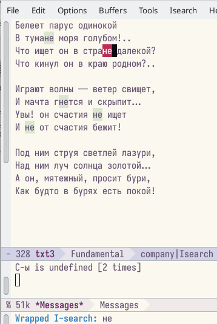{#fig:020 width=0%}

- 9.3. Выйдите из режима поиска, нажав C-g.

- 9.4. Перейдите в режим поиска и замены (M-%), введите текст, который следует найти и заменить, нажмите Enter , затем введите текст для замены. После того как будут
подсвечены результаты поиска, нажмите ! для подтверждения замены.(рис. @fig:021),(рис. @fig:022)

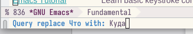{#fig:021 width=40%}

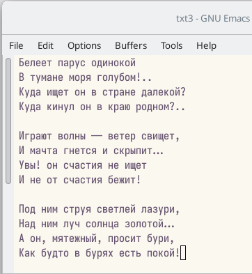{#fig:022 width=40%}

- 9.5. Попрбуем режим поиска (M-s o). Данный поиск отличается тем, что тут считывается строка поиска, которая трактуется как регулярное выражение,
и не осуществляемся поиск точно совпадения в тексте буфера. Регулярное выражение - это образец, который обозначает набор строк, возможно, и неограничнный набор

# Выводы

В ходе выполнения данной лабораторной работы я познакомилась с операционной системой Lunix и получила практические навыки по работе с редактором
Emacs.

# Ответы на контрольные вопросы

1. Emacs − один из наиболее мощных и широко распространённых редакторов,
используемых в мире Unix. По популярности он соперничает с редактором
vi и его клонами. В зависимости от ситуации, Emacs может быть:
- текстовым редактором;
- программой для чтения почты и новостей Usenet;
- интегрированной средой разработки (IDE);
- операционной системой и т.д. Всё это разнообразие достигается благодаря
архитектуре Emacs, которая позволяет расширять возможности редактора
при помощи языка Emacs Lisp. На языке C написаны лишь самые базовые и
низкоуровневые части Emacs, включая полнофункциональный интерпретатор языка Lisp. Таким образом, Emacs имеет встроенный язык программирования, который может использоваться для настройки, расширения и
изменения поведения редактора. В действительности, большая часть того
редактора, с которым пользователи Emacs работают в наши дни, написана
на языке Lisp.

2. Основную трудность для новичков при освоении данного редактора могут
составлять большое количество команд, комбинаций клавиш, которые не
получится все запомнить с первого раза и поэтоу придется часто обращаться
к справочным материалам.

3. Буфер – это объект, представляющий собой текст. Если имеется несколько
буферов, то редактировать можно только один. Обычно буфер считывает
данные из файла или записывает в файл данные из буфера. Окно – это
область экрана, отображающая буфер. При запуске редактора отображается
одно окно, но при обращении к некоторым функциям могут открыться
дополнительные окна. Окна Emacs и окна графической среды X Window –
разные вещи. Одно окно X Window может быть разбито на несколько окон
в смысле Emacs, в каждом из которых отображается отдельный буфер.

4. Да, можно.

5. При запуске Emacs по умолчанию создаются следующие буферы:
- «scratch» (буфер для несохраненного текста)
- «Messages» (журнал ошибок, включающий также информацию, которая
появляется в области EchoArea)
- «GNU Emacs» (справочный буфер о редакторе)

6. C-c | сначала, удерживая «ctrl», нажимаю «c», после – отпускаю обе клави-
ши и нажимаю «|» C-c C-| сначала, удерживая «ctrl», нажимаю «с», после –
отпускаю обе клавиши и, удерживая «ctrl», нажимаю «|»

7. Чтобы поделить окно на две части необходимо воспользоваться комбина-
цией «Ctrl-x 3» (по вертикали) или «Ctrl-x 2» (по горизонтали).

8. Настройки Emacs хранятся в файле .emacs.

9. По умолчанию клавиша «» удаляет символ перед курсором, но в редакторе
её можно переназначить. Для этого необхдимо изменить конфигурацию
файла .emacs.

10. Более удобным я считаю редактор emacs, потому что в нем проще открывать
другие файлы, можно использовать сразу несколько окон, нет «Командного
режима», «Режима ввода», «Режима командной строки», которые являются
немного непривычными и в какой-то степени неудобными.

