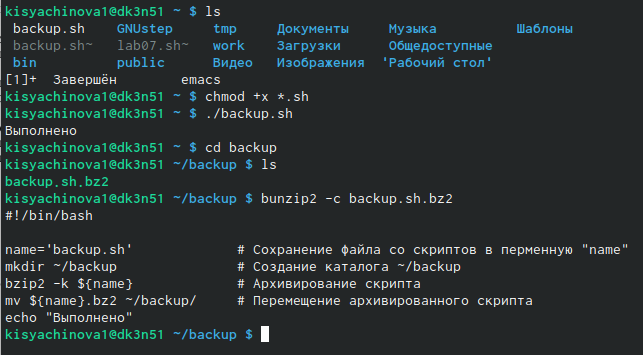

---
## Front matter
lang: ru-RU
title: Презентация по лабораторной работе №10
subtitle: Операционные системы
author:
  - Сячинова Ксения Ивановна
institute:
  - Российский университет дружбы народов, Москва, Россия
date: 22 марта 2023

## i18n babel
babel-lang: russian
babel-otherlangs: english

## Formatting pdf
toc: false
toc-title: Содержание
slide_level: 2
aspectratio: 169
section-titles: true
theme: metropolis
header-includes:
 - \metroset{progressbar=frametitle,sectionpage=progressbar,numbering=fraction}
 - '\makeatletter'
 - '\beamer@ignorenonframefalse'
 - '\makeatother'
---

# Цель работы

Изучить основы программирования в оболочке ОС UNIX/Linux. Научиться писать небольшие командные файлы

# Задание

1. Написать скрипт, который при запуске будет делать резервную копию самого себя (то есть файла, в котором содержится его исходный код) в другую директорию backup в вашем домашнем каталоге. При этом файл должен архивироваться одним из архиваторов на выбор zip, bzip2 или tar. Способ использования команд архивации необходимо узнать, изучив справку.

2. Написать пример командного файла, обрабатывающего любое произвольное число
аргументов командной строки, в том числе превышающее десять. Например, скрипт
может последовательно распечатывать значения всех переданных аргументов.

##

3. Написать командный файл — аналог команды ls (без использования самой этой команды и команды dir). Требуется, чтобы он выдавал информацию о нужном каталоге
и выводил информацию о возможностях доступа к файлам этого каталога.

4. Написать командный файл, который получает в качестве аргумента командной строки формат файла (.txt, .doc, .jpg, .pdf и т.д.) и вычисляет количество таких файлов в указанной директории. Путь к директории также передаётся в виде аргумента командной строки.

# Выполнение лабораторной работы

1. Созадид папку "lab10", где будут все наши скрипты.

Для начала изучим кмонады для архивации. Для этого используем команду "man".

{#fig:001 width=40%}

##

{#fig:002 width=30%}

{#fig:003 width=30%}

##

{#fig:004 width=40%}

##

Далее создадим файл, в которм будет написан скрипт. Откроем его с помощью редактора "emacs" (сочетание клавиш "c+x", "c+f").

{#fig:005 width=40%}

{#fig:006 width=40%}

##

Напишем скрипт согласно задания. При написании скрипта я буду использовать архиватор "bzip2".

{#fig:007 width=40%}

##

Сохраняем файл. Добавим право на выполнение с помощью команды "chmod +x *.sh" и проверим работу скрипта. Также проверим, появился ли каталог и просматриваем его содержимое, где видим наш архив. Для просмотра архива введём команду "bunzip2 -c backup.sh.bz2"

{#fig:008 width=40%}

##

2. Создадим файл для второго скрипта и откроем его. 

{#fig:009 width=40%}

##

Напишем соответсвующий скрипт. 

{#fig:010 width=40%}

##

Проверим работу скрипта. Для этго испольузем команду "./os2.sh "Аргументы"". Но для начала дадим право на выполнение. Введём количество аргументов больше и меньше 10. Скрип работает корректно.

{#fig:011 width=40%}

##

3. Создадим файл для написания тертьего скрипта. Также открываем его в "emacs".

{#fig:012 width=40%}

##

Напишем командный файл — аналог команды ls (без использования самой этой команды и команды dir).

{#fig:013 width=25%}

##

Затем даём право на выполнение и првоеряем работу скрипта. 

{#fig:014 width=40%}

##

4. Для выполнения последнего пунтка создём файл для работу и открываем его. 

{#fig:015 width=40%}

##

Напишем скрипт по заданию. 

{#fig:016 width=40%}

##

Далее проверим работу. Дадим право на исполнение и в домашнем каталоги создадим пару файлов. Првоерим работу. 

{#fig:017 width=40%}

# Выводы

В процессе выполнения данной лабораторной работы я изучила основы программирования в оболочке ОС UNIX/Linux, научилась писать небольшие командные файлы
