---
## Front matter
lang: ru-RU
title: Презентация по лабораторной работе №11
subtitle: Операционные системы
author:
  - Сячинова Ксения Ивановна
institute:
  - Российский университет дружбы народов, Москва, Россия
date: 23 марта 2023

## i18n babel
babel-lang: russian
babel-otherlangs: english

## Formatting pdf
toc: false
toc-title: Содержание
slide_level: 2
aspectratio: 169
section-titles: true
theme: metropolis
header-includes:
 - \metroset{progressbar=frametitle,sectionpage=progressbar,numbering=fraction}
 - '\makeatletter'
 - '\beamer@ignorenonframefalse'
 - '\makeatother'
---

# Цель работы

Изучить основы программирования в оболочке ОС UNIX. Научится писать более сложные командные файлы с использованием логических управляющих конструкций и циклов.

# Задание

1. Используя команды getopts grep, написать командный файл, который анализирует
командную строку с ключами:
- -iinputfile — прочитать данные из указанного файла;
- -ooutputfile — вывести данные в указанный файл;
- -pшаблон — указать шаблон для поиска;
- -C — различать большие и малые буквы;
- -n — выдавать номера строк.
а затем ищет в указанном файле нужные строки, определяемые ключом -p.

2. Написать на языке Си программу, которая вводит число и определяет, является ли оно
больше нуля, меньше нуля или равно нулю. Затем программа завершается с помощью
функции exit(n), передавая информацию в о коде завершения в оболочку. Командный файл должен вызывать эту программу и, проанализировав с помощью команды $?, выдать сообщение о том, какое число было введено.

##

3. Написать командный файл, создающий указанное число файлов, пронумерованных последовательно от 1 до N (например 1.tmp, 2.tmp, 3.tmp,4.tmp и т.д.). Число файлов, которые необходимо создать, передаётся в аргументы командной строки. Этот же командный файл должен уметь удалять все созданные им файлы (если они существуют).

4. Написать командный файл, который с помощью команды tar запаковывает в архив все файлы в указанной директории. Модифицировать его так, чтобы запаковывались только те файлы, которые были изменены менее недели тому назад (использовать команду find).

# Выполнение лабораторной работы

1. Для начала сосздадим папку, где буду находиться все наши скринкасты к лабораторной работе. 

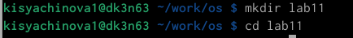{#fig:001 width=30%}

Создадим файл для написания скрипта и откроем его. 

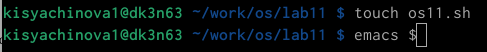{#fig:002 width=30%}

##

Напишем скрипт для выполнения первого задания. 

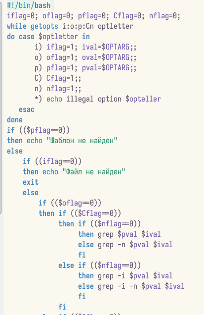{#fig:003 width=20%}

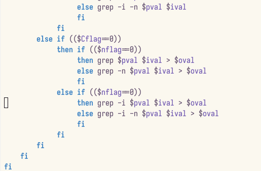{#fig:004 width=20%}

##

Для проверки работы скрипта создадим два текстовых файла. В один из них запишем текст для проверка.

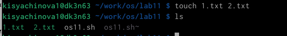{#fig:005 width=50%}

##

Даём право на выполнение с помощью команды "chmod" и используем команды для проверки. Скрипт работает корректно.

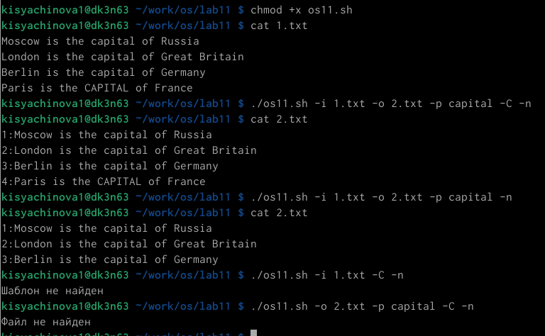{#fig:006 width=30%}

##

2. Напишем скрипт для выполнения второго задания. Для этого также создадим файл. 

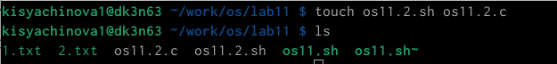{#fig:007 width=50%}

##

Напишем скрин на языке "C" и "bush". 

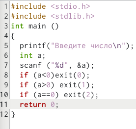{#fig:008 width=20%}

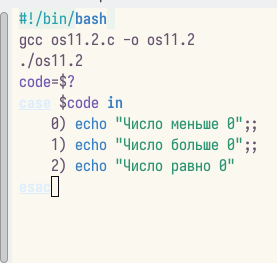{#fig:009 width=20%}

##

Затем даём право на выполнение и проверяем. Всё работает корректно. 

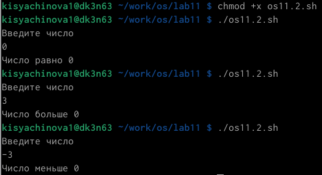{#fig:010 width=50%}

##

3. Далее выпоним третье задание. Создаём новый файл для скрипта и открываем его.

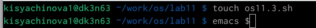{#fig:011 width=30%}

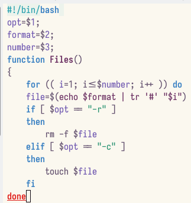{#fig:012 width=30%}

##

Првоерим работу скрипта. Даём право на выполнение файла. Создадим три файла, а затем удалим их с помощью программы.

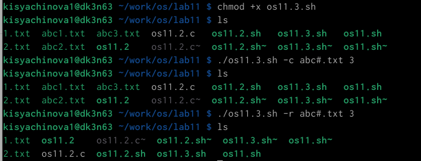{#fig:013 width=30%}

##

4. Создаём файл и пишем скрипт. 

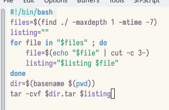{#fig:014 width=50%}

##

Даём право на выполнение и првоеряем. Всё работвет верно.

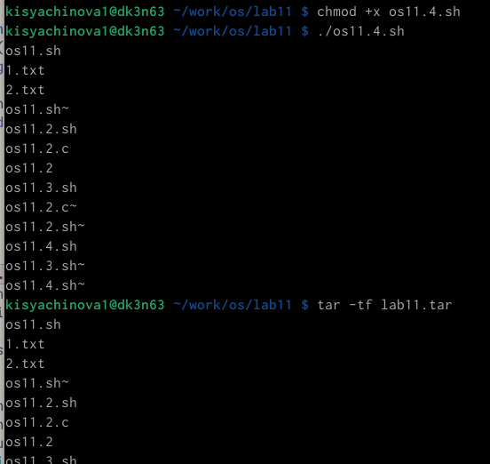{#fig:015 width=20%}

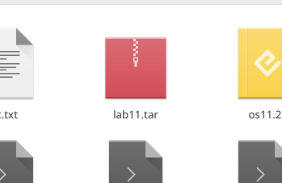{#fig:016 width=20%}

# Выводы

В процессе выполнения данной лабораторной работы я изучила основы программирования в оболочке ОС UNIX. Научилась писать более сложные командные файлы с использованием логических управляющих конструкций и циклов.

