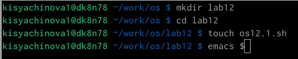
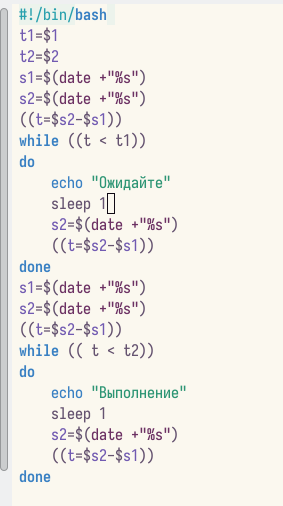
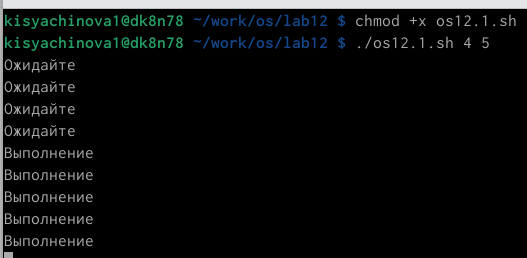
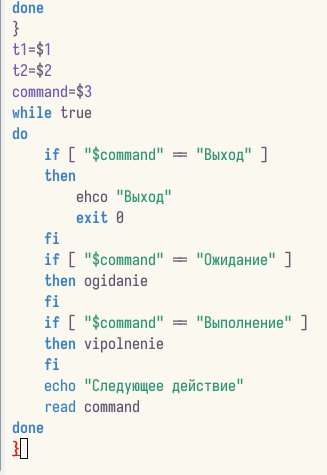
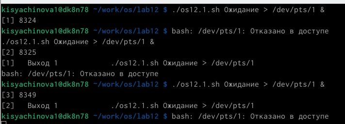
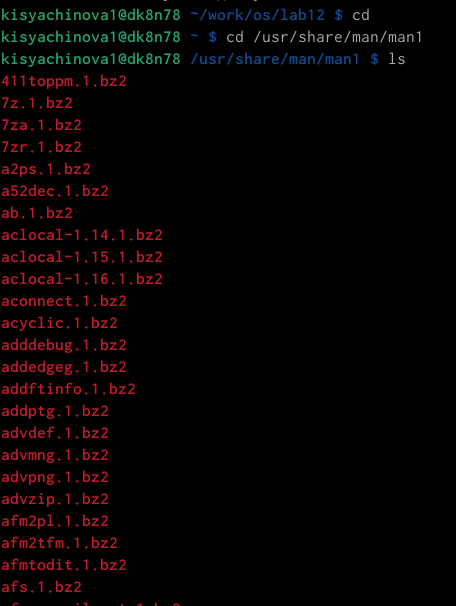
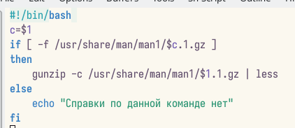
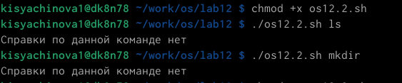
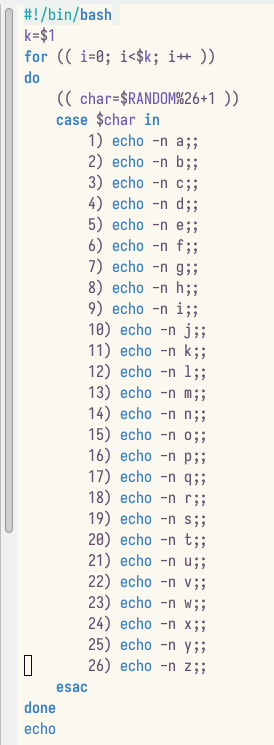
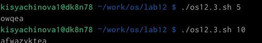

---
## Front matter
lang: ru-RU
title: Презентация по лабораторной работе №12
subtitle: Операционные системы
author:
  - Сячинова Ксения Ивановна
institute:
  - Российский университет дружбы народов, Москва, Россия
date: 24 марта 2023

## i18n babel
babel-lang: russian
babel-otherlangs: english

## Formatting pdf
toc: false
toc-title: Содержание
slide_level: 2
aspectratio: 169
section-titles: true
theme: metropolis
header-includes:
 - \metroset{progressbar=frametitle,sectionpage=progressbar,numbering=fraction}
 - '\makeatletter'
 - '\beamer@ignorenonframefalse'
 - '\makeatother'
---
# Цель работы

Изучить основы программирования в оболочке ОС UNIX. Научиться писать более сложные командные файлы с использованием логических управляющих конструкций и циклов.

# Задание

1. Написать командный файл, реализующий упрощённый механизм семафоров. Командный файл должен в течение некоторого времени t1 дожидаться освобождения ресурса, выдавая об этом сообщение, а дождавшись его освобождения, использовать его в течение некоторого времени t2<>t1, также выдавая информацию о том, что ресурс используется соответствующим командным файлом (процессом). Запустить командный файл в одном виртуальном терминале в фоновом режиме, перенаправив его вывод в другой (> /dev/tty#, где # — номер терминала куда перенаправляется
вывод), в котором также запущен этот файл, но не фоновом, а в привилегированном режиме. Доработать программу так, чтобы имелась возможность взаимодействия трёх и более процессов.

##

2. Реализовать команду man с помощью командного файла. Изучите содержимое каталога /usr/share/man/man1. В нем находятся архивы текстовых файлов, содержащих справку по большинству установленных в системе программ и команд. Каждый архив можно открыть командой less сразу же просмотрев содержимое справки. Командный файл должен получать в виде аргумента командной строки название команды и в виде
результата выдавать справку об этой команде или сообщение об отсутствии справки, если соответствующего файла нет в каталоге man1.

3. Используя встроенную переменную $RANDOM, напишите командный файл, генерирующий случайную последовательность букв латинского алфавита. Учтите, что $RANDOM выдаёт псевдослучайные числа в диапазоне от 0 до 32767.

# Выполнение лабораторной работы

1. Создадим рабочее пространоство для скриптов данной лабораторной работы. также создадим файл, в который запишем наш скрипт 

{#fig:001 width=50%}

##

Напишем скрипт для выполнения здадния.

{#fig:002 width=20%}

##

Даём право на выолнение и проверяем работу. Скрип работает корректно.

{#fig:003 width=30%}

##

Далее изменим скрипт там, чтобы можно было его выполнять в нескольких терминалах.При проверке мне было отказано в доступе

{#fig:004 width=30%}

{#fig:005 width=30%}

##

2. Выполним второе задание. Для начала изучим содержимое файла "/usr/share/man/man1"

{#fig:006 width=20%}

##

Создадим файла для скрипта и напишем его. Далее добавим право на выполнение и проверим его. 

{#fig:007 width=20%}

{#fig:008 width=20%}

##

3. Напишем скрипт для выполнение третьего задания. 

{#fig:009 width=20%}

##

{#fig:010 width=50%}

# Выводы

В процессе выполнения данной лабораторной работы я изучила основы программирования в оболочке ОС UNIX и научтлась писать более сложные командные файлы с использованием логических управляющих конструкций и циклов.

