---
## Front matter
lang: ru-RU
title: Презентация по лабораторной работе №13
subtitle: Операционные системы
author:
  - Сячинова Ксения Ивановна
institute:
  - Российский университет дружбы народов, Москва, Россия
date: 07 апреля 2023

## i18n babel
babel-lang: russian
babel-otherlangs: english

## Formatting pdf
toc: false
toc-title: Содержание
slide_level: 2
aspectratio: 169
section-titles: true
theme: metropolis
header-includes:
 - \metroset{progressbar=frametitle,sectionpage=progressbar,numbering=fraction}
 - '\makeatletter'
 - '\beamer@ignorenonframefalse'
 - '\makeatother'
---

# Цель работы

Приобрести простейшие навыки разработки, анализа, тестирования и отладки приложений в ОС типа UNIX/Linux на примере создания на языке программирования С калькулятора с простейшими функциями.

## Выполнение лабораторной работы

1. В домашнем каталоге создаём подкаталог "~/work/os/lab_prog" с помощью комнады "mkdir".

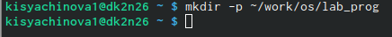{#fig:001 width=40%}

##

2. Затем перейдём в каталог и создадим файлы: calculate.h, calculate.c, main.c. Делаю это с помощью команды “touch”.

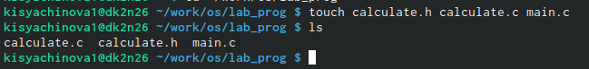{#fig:002 width=50%}

##

Создадим примитинейший калькулятор, способный складывать, вычитать,
умножать и делить, возводить число в степень, брать квадратный корень, вычислять sin,cos,tan. При запуске он будет запрашивать первое число, операцию,второе число. После этого программа выведет результат и остановится. Реализация функций калькулятора будет делать в файле calculate.c.

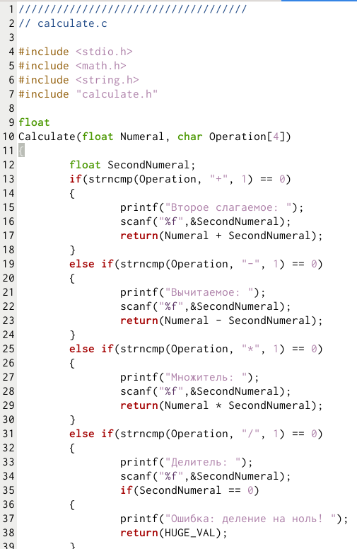{#fig:003 width=20%}

##

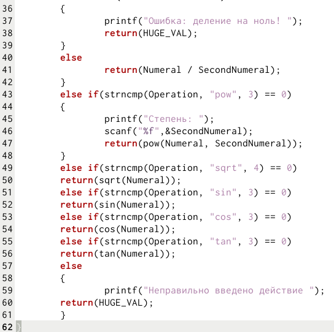{#fig:004 width=30%}

##

Интерфейсный файл calculate.h, описывающий формат вызова функции калькулятора.

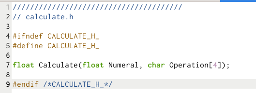{#fig:005 width=40%}

##

Основной файл main.c, реализующий интерфейс пользователя к калькулятору. 

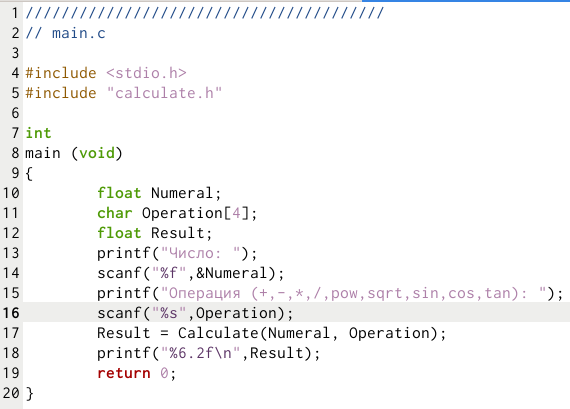{#fig:006 width=40%}

## 

3. Далее выполним компиляцию программы посредством gcc. 

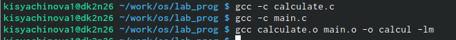{#fig:007 width=50%}

4. Ошибок не выявлено

##

5. Создадим Makefile c необходимым содержанием. Он необходим для автоматической компиляции файлов calculate.c (цель calculate.o), main.c (цель main.o), а так же их объединения в один исполняемый файл calcul. Цель “clean” нужна доя автоматического удаления файлов. Переменная “CC” отвечает за утилиту для компиляции. Переменная “CFLAGS” отвечает за опции в данной утилите. Переменная “LIBS” отвечает за опции для объединения объектных файлов в один исполняемый файл.

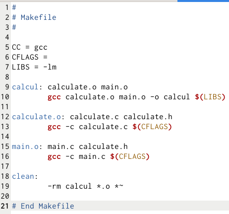{#fig:008 width=20%}

##

6. Далее изменим файл. В переменную CFLAGS добавим “-g”, которая необходима для компиляции объектных файлов и их использования в программе отладчика GDB. Также, компиляция выбирается с помощью переменной СС.

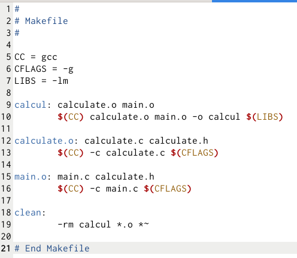{#fig:009 width=40%}

##

После выполняем компиляцию файлов. 

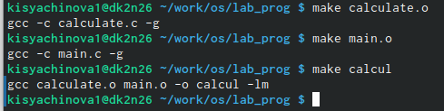{#fig:010 width=40%}

## 

После этого выполняем gdb отладку программмы calcul. Запускаем GDB и
загружаем в него программу для отладки, используя команду “gdb ./calcul”

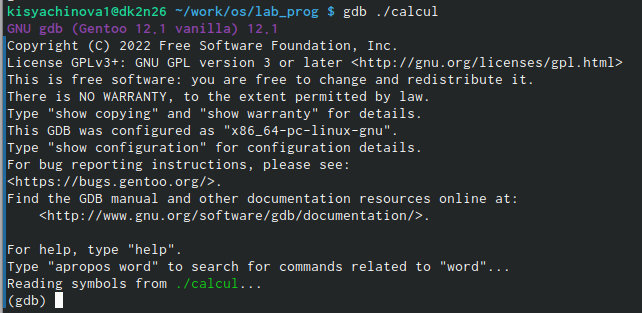{#fig:011 width=40%}

##

Далее вводим комнаду “run” для запуска программы внутри откадчика.

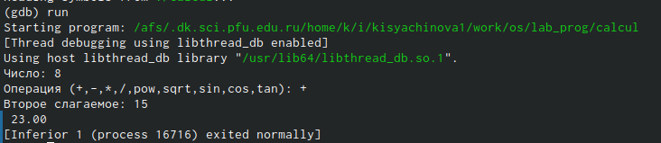{#fig:012 width=40%}

##

Для постраничего просмотра исходного кода используем команду “list”.

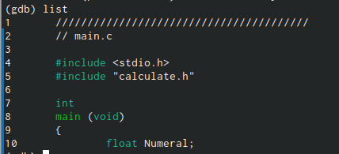{#fig:013 width=40%}

##

Для просмотра строк с 12 по 15 основного файла используем команду “list 12,15”.

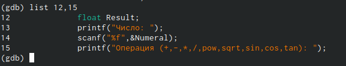{#fig:014 width=40%}

##

Для просмотра определённых строк не основного файла используем команду
“list calculate.c:20,29”.

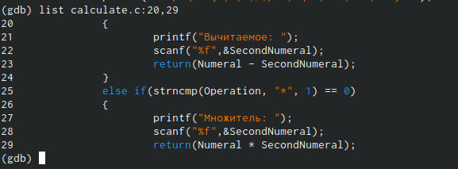{#fig:015 width=40%}

##

Для установки точки в файле “calculate.c” на строке 21 используем команды “list calculate.c:20,27” и “break 21”.

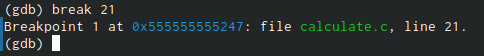{#fig:016 width=40%}

##

Чтобы вывесни информацию об имеющихся точках останова используем команду “info breakpoint”

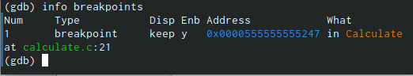{#fig:017 width=50%}

##

Запустим программу внутри отладчика и убедимся, что программа остановилась в момент прохождения точки останова.

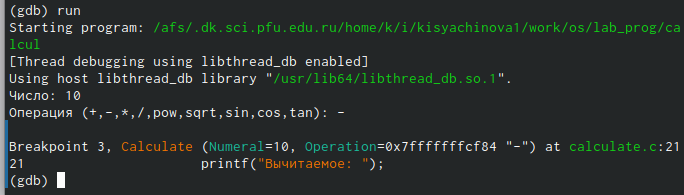{#fig:018 width=50%}

##

Посмотрим, чему на этом этапе равно значение переменной Numeral, с помощью команды “print Numeral” и сравним его с результатом вывода на экарн после использования команды “display Numeral”. Значения совпадают.

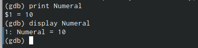{#fig:019 width=50%}

##

Уберём точки останова с помощью команды “d breakpoints”

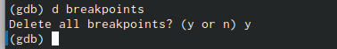{#fig:020 width=50%}

##

7. С помощью утилиты splint проанализировала коды файлов calculate.c и main.c.

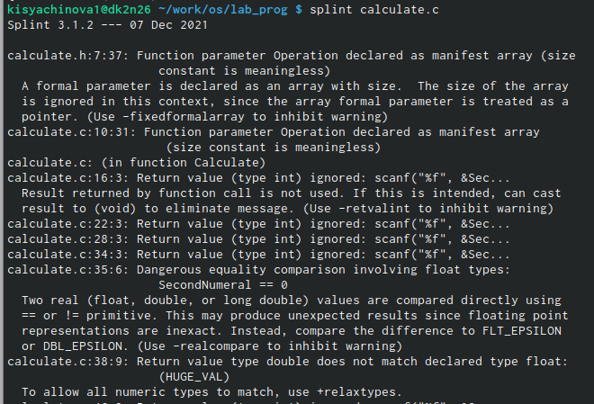{#fig:021 width=50%}

##

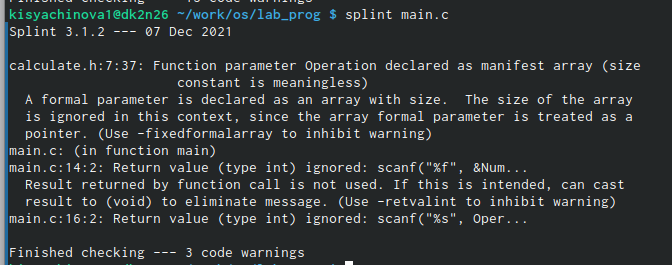{#fig:022 width=50%}

# Выводы

В ходе выполнения данной лабораторной работы я приобрела простейшие
навыки разработки, анализа, тестирования и отладки приложений в OC типа
UNIX/Linux на примере создания на языке программирования С калькулятора с простейшими функциями.

