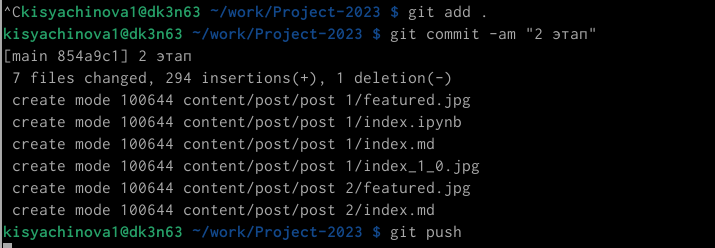

---
## Front matter
lang: ru-RU
title: Презентация по 2 этапу индивидуального проекта
subtitle: Операционные системы
author:
  - Сячинова Ксения Ивановна
institute:
  - Российский университет дружбы народов, Москва, Россия
date: 16 марта 2023

## i18n babel
babel-lang: russian
babel-otherlangs: english

## Formatting pdf
toc: false
toc-title: Содержание
slide_level: 2
aspectratio: 169
section-titles: true
theme: metropolis
header-includes:
 - \metroset{progressbar=frametitle,sectionpage=progressbar,numbering=fraction}
 - '\makeatletter'
 - '\beamer@ignorenonframefalse'
 - '\makeatother'
---

## Цель работы

Добавить к сайту данные о себе.

# Задание

- Разместить фотографию владельца сайта.
- Разместить краткое описание владельца сайта (Biography)
- Добавить информацию об интересах (Interests).
- Добавить информацию от образовании (Education).
- Сделать пост по прошедшей неделе.
- Добавить пост на тему по выбору:
- Управление версиями. Git.
- Непрерывная интеграция и непрерывное развертывание (CI/CD).

# Выполнение лабораторной работы

1. Для размещения фотографии заходим в  "authors" -> "admin" и добавляем фотографию. 

{#fig:001 width=30%}

##

2. Добавим краткое описание владельца сайта, информацию о интересах, образовании. В этой же папке открывает файл "md" и изменяем информацию. Для добавления боиграфии переходим в самый низ!!

{#fig:002 width=30%}

{#fig:003 width=30%}

##

3. Далее добавим пост недели и пост по выбору. Переходим в папку "contents" -> "post" и добавляем необходимую информацию. 

{#fig:004 width=20%}

{#fig:005 width=30%}

##

{#fig:006 width=20%}

{#fig:007 width=20%}

##

4. Выгружаем всё на сайт, используя знакомые команды и не забываем делать это и из "public". Проверяем сайт.

{#fig:008 width=30%}

# Выводы

В ходе выполнения данной работы я получила основы создания сайта, а так же научилась изменять инфомрацию о себе и писать посты.

