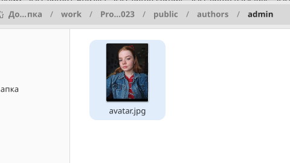
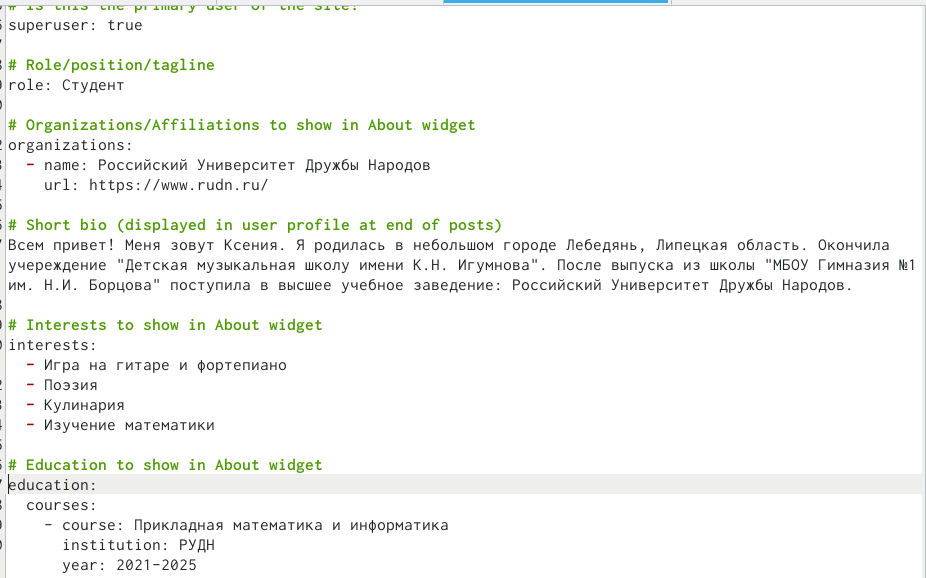
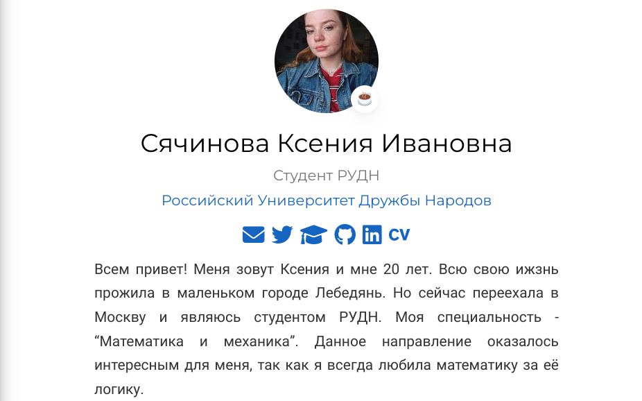
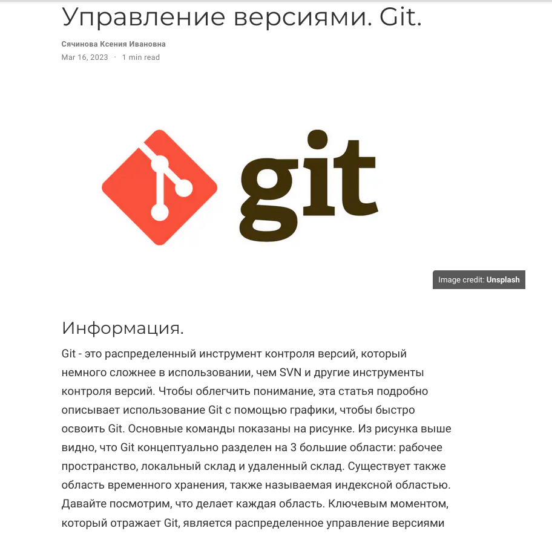
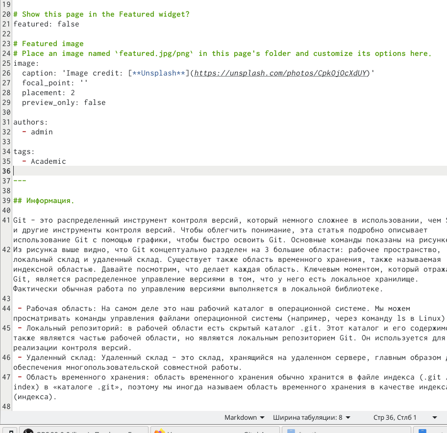
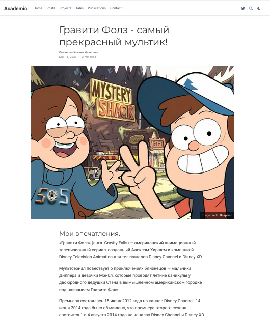
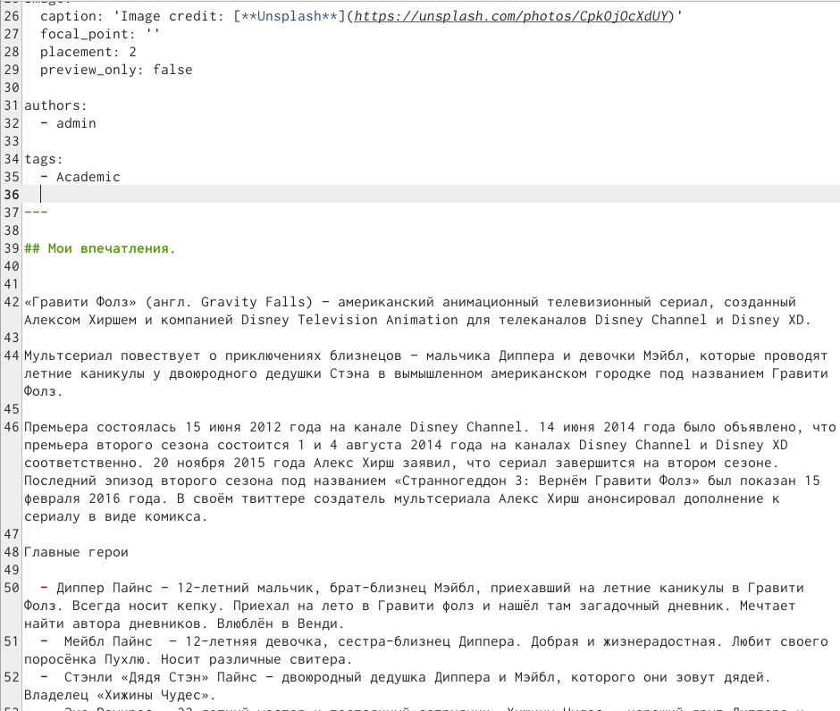
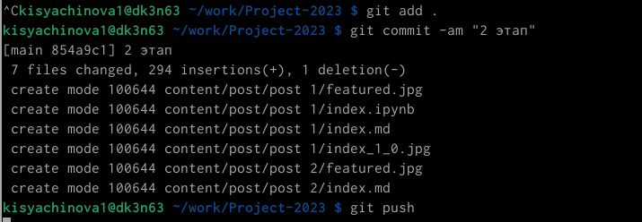

---
## Front matter
title: "Отчёт по 2 этапу индивидуального проекта"
subtitle: "Операционные системы"
author: "Сячинова Ксения Ивановна"

## Generic otions
lang: ru-RU
toc-title: "Содержание"

## Bibliography
bibliography: bib/cite.bib
csl: pandoc/csl/gost-r-7-0-5-2008-numeric.csl

## Pdf output format
toc: true # Table of contents
toc-depth: 2
lof: true # List of figures
lot: false # List of tables
fontsize: 12pt
linestretch: 1.5
papersize: a4
documentclass: scrreprt
## I18n polyglossia
polyglossia-lang:
  name: russian
  options:
	- spelling=modern
	- babelshorthands=true
polyglossia-otherlangs:
  name: english
## I18n babel
babel-lang: russian
babel-otherlangs: english
## Fonts
mainfont: PT Serif
romanfont: PT Serif
sansfont: PT Sans
monofont: PT Mono
mainfontoptions: Ligatures=TeX
romanfontoptions: Ligatures=TeX
sansfontoptions: Ligatures=TeX,Scale=MatchLowercase
monofontoptions: Scale=MatchLowercase,Scale=0.9
## Biblatex
biblatex: true
biblio-style: "gost-numeric"
biblatexoptions:
  - parentracker=true
  - backend=biber
  - hyperref=auto
  - language=auto
  - autolang=other*
  - citestyle=gost-numeric
## Pandoc-crossref LaTeX customization
figureTitle: "Рис."
tableTitle: "Таблица"
listingTitle: "Листинг"
lofTitle: "Список иллюстраций"
lotTitle: "Список таблиц"
lolTitle: "Листинги"
## Misc options
indent: true
header-includes:
  - \usepackage{indentfirst}
  - \usepackage{float} # keep figures where there are in the text
  - \floatplacement{figure}{H} # keep figures where there are in the text
---

# Цель работы

Добавить к сайту данные о себе.

# Задание

- Разместить фотографию владельца сайта.
- Разместить краткое описание владельца сайта (Biography)
- Добавить информацию об интересах (Interests).
- Добавить информацию от образовании (Education).
- Сделать пост по прошедшей неделе.
- Добавить пост на тему по выбору:
- Управление версиями. Git.
- Непрерывная интеграция и непрерывное развертывание (CI/CD).

# Выполнение лабораторной работы

1. Для размещения фотографии заходим в  "authors" -> "admin" и добавляем фотографию. (рис. @fig:001).

{#fig:001 width=50%}

2. Добавим краткое описание владельца сайта, информацию о интересах, образовании. В этой же папке открывает файл "md" и изменяем информацию. Для добавления боиграфии переходим в самый низ!!(рис. @fig:002).(рис. @fig:003).

{#fig:002 width=50%}

{#fig:003 width=50%}

3. Далее добавим пост недели и пост по выбору. Переходим в папку "contents" -> "post" и добавляем необходимую информацию. (рис. @fig:004).(рис. @fig:005).(рис. @fig:006).(рис. @fig:007).

{#fig:004 width=50%}

{#fig:005 width=50%}

{#fig:006 width=50%}

{#fig:007 width=50%}

4. Выгружаем всё на сайт, используя знакомые команды и не забываем делать это и из "public". Проверяем сайт.(рис. @fig:008).

{#fig:008 width=50%}

# Выводы

В ходе выполнения данной работы я получила основы создания сайта, а так же научилась изменять инфомрацию о себе и писать посты.

