---
## Front matter
lang: ru-RU
title: Отчёт по 3 этапу индивидуального проекта
subtitle: Операционные системы
author:
  - Сячинова Ксения Ивановна
institute:
  - Российский университет дружбы народов, Москва, Россия
date: 17 марта 2023

## i18n babel
babel-lang: russian
babel-otherlangs: english

## Formatting pdf
toc: false
toc-title: Содержание
slide_level: 2
aspectratio: 169
section-titles: true
theme: metropolis
header-includes:
 - \metroset{progressbar=frametitle,sectionpage=progressbar,numbering=fraction}
 - '\makeatletter'
 - '\beamer@ignorenonframefalse'
 - '\makeatother'
---
# Цель работы

Выполнить третий этап проекта. Добавить новую информацию о себе и новые посты.

# Задание
    **Список достижений.**
- Добавить информацию о навыках (Skills).
- Добавить информацию об опыте (Experience).
- Добавить информацию о достижениях (Accomplishments).
- Сделать пост по прошедшей неделе.
- Добавить пост на тему по выбору:
- *Легковесные языки разметки.*
- *Языки разметки. LaTeX.*
- *Язык разметки Markdown.*

# Выполнение лабораторной работы

1. Добавим информацию о своих навыках. Для этого переходим в папку "content" и открывает файл "_index.md". 

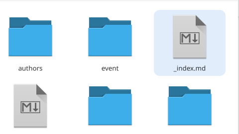{#fig:001 width=40%}

##

2. Изменяем все пункты под себя. 

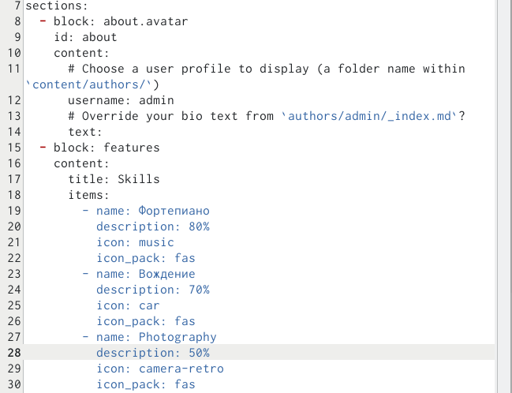{#fig:002 width=30%}

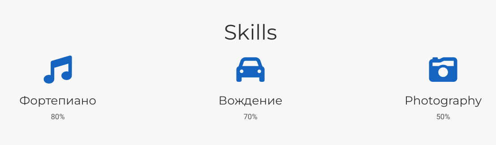{#fig:003 width=30%}

##

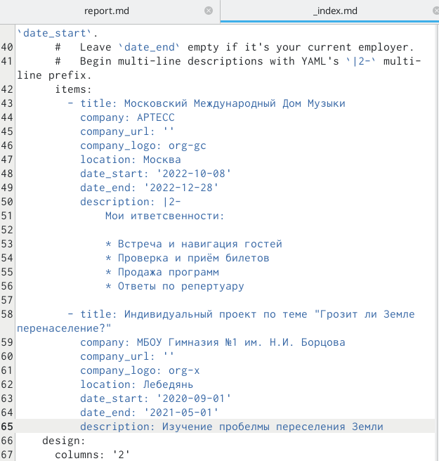{#fig:004 width=30%}

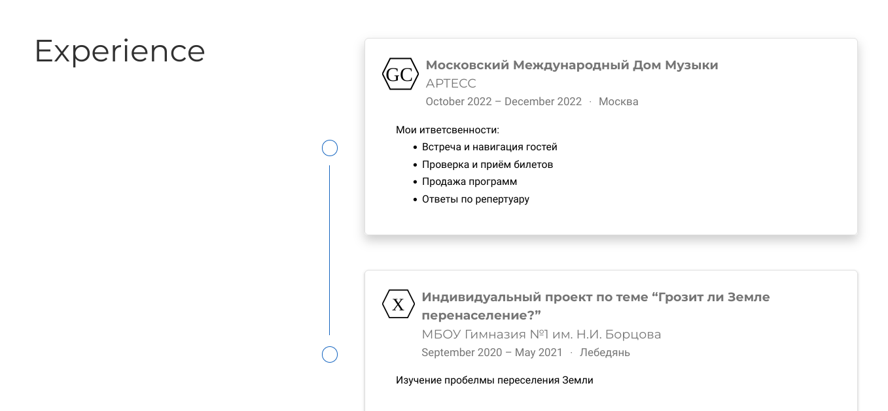{#fig:005 width=30%}

##

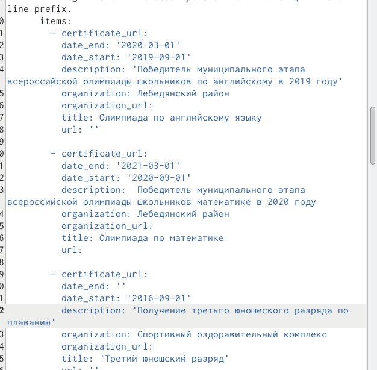{#fig:006 width=30%}

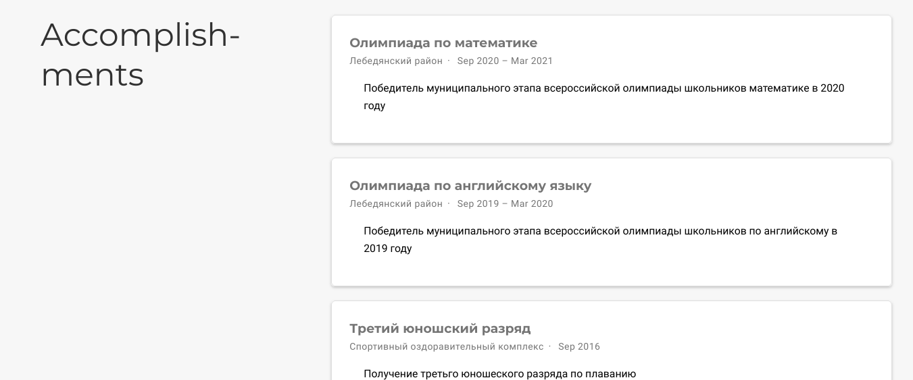{#fig:007 width=30%}

##

3. Сделаем пост недели. 

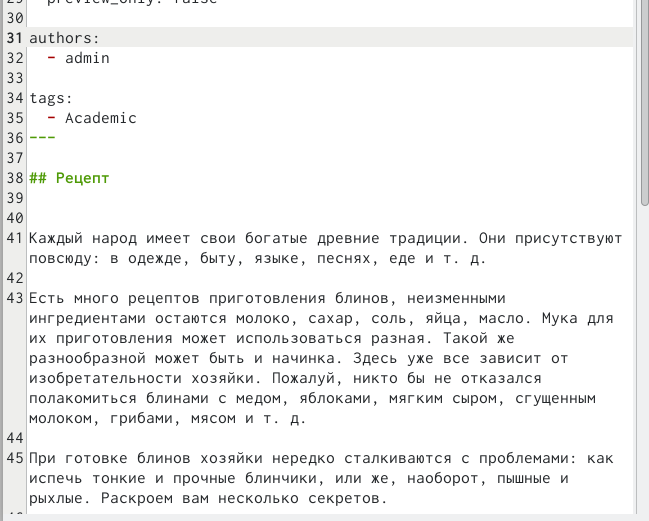{#fig:008 width=20%}

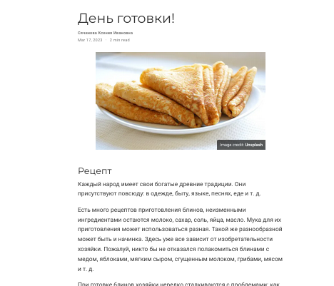{#fig:009 width=20%}

##

4. Сделаем пост по выбору. 

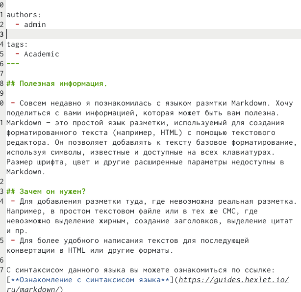{#fig:010 width=20%}

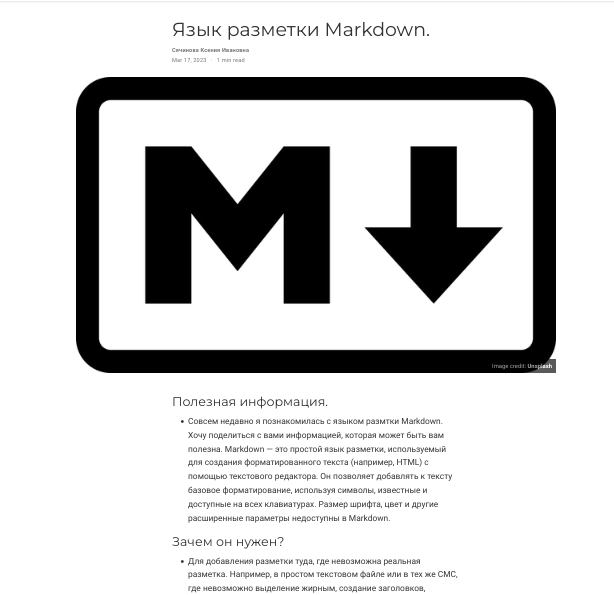{#fig:011 width=20%}

##

5. Строим сайт с помощью команды "hugo" и загружаем через "public" и наш проект. 

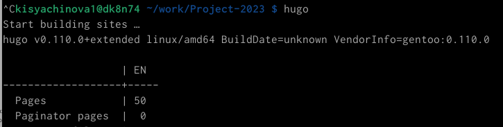{#fig:012 width=30%}

# Выводы

В процессе выполнения данной лабораторной работы я получила новые навыки по созданию сайта, добавила новую информацию о себе.

