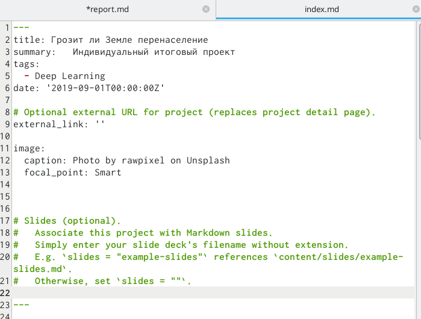
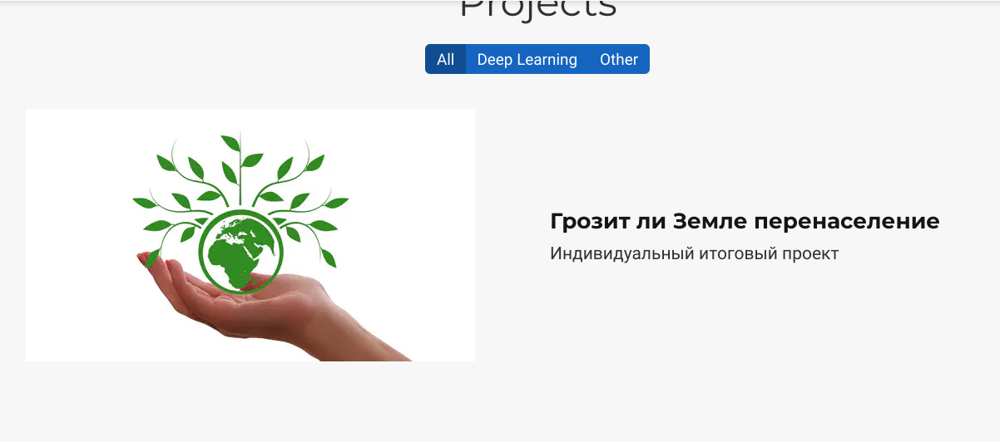
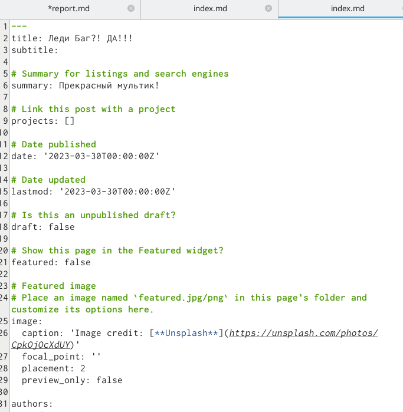
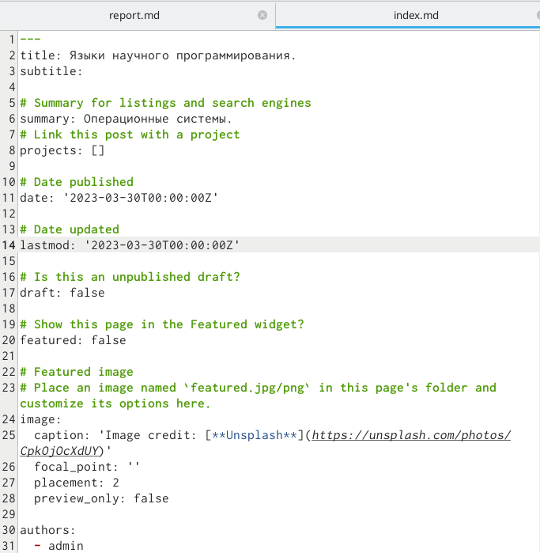
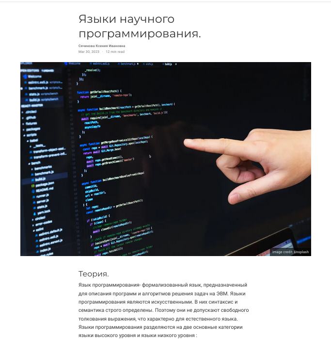
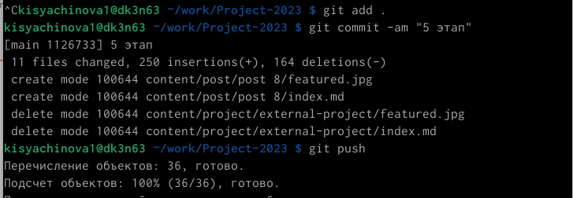
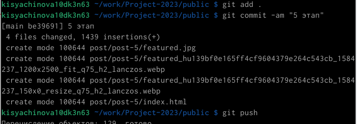

---
## Front matter
lang: ru-RU
title: Презентация по 5 этапу индивидуального проекта.
subtitle: Операционные системы
author:
  - Сячинова Ксения Ивановна
institute:
  - Российский университет дружбы народов, Москва, Россия
date: 30 марта 2023

## i18n babel
babel-lang: russian
babel-otherlangs: english

## Formatting pdf
toc: false
toc-title: Содержание
slide_level: 2
aspectratio: 169
section-titles: true
theme: metropolis
header-includes:
 - \metroset{progressbar=frametitle,sectionpage=progressbar,numbering=fraction}
 - '\makeatletter'
 - '\beamer@ignorenonframefalse'
 - '\makeatother'
---

# Цель работы

Продолжение создания сайта. Получение новых навыков.

# Задание

**Добавить к сайту все остальные элементы.**

- Сделать записи для персональных проектов.

- Сделать пост по прошедшей неделе.

- Добавить пост на тему по выбору.

 *Языки научного программирования.*

# Выполнение лабораторной работы

1. Сделаем записи для персональных проектов. Для этого переходим в папку
contents -> project и делаем необходимые изменения.

{#fig:001 width=20%}

{#fig:002 width=20%}

##

2. Затем сделаем новый пост. Создаём новую папку в которй будет вся инфомрация. 

{#fig:003 width=20%}

{#fig:004 width=20%}

##

3. Сделаем пост на тему "Языки научного программирования"

{#fig:005 width=20%}

{#fig:006 width=20%}

##

4. Затем выгружаем все материалы на сайт. Для этого делаем команды из publica и из папки нашего проекта.

{#fig:007 width=30%}

{#fig:008 width=30%}

# Выводы

В процессе выполнения данного этапа проекта я приобрела практические навыки по созданию сайта, получила новые знания. 

