---
## Front matter
lang: ru-RU
title: Презентация по 6 этапу индивидуального проекта
subtitle: Операционные системы
author:
  - Сячинова Ксения Ивановна
institute:
  - Российский университет дружбы народов, Москва, Россия
date: 30 марта 2023

## i18n babel
babel-lang: russian
babel-otherlangs: english

## Formatting pdf
toc: false
toc-title: Содержание
slide_level: 2
aspectratio: 169
section-titles: true
theme: metropolis
header-includes:
 - \metroset{progressbar=frametitle,sectionpage=progressbar,numbering=fraction}
 - '\makeatletter'
 - '\beamer@ignorenonframefalse'
 - '\makeatother'
---

# Цель работы

Закончить оформление сайта, приобрести новые навыки по созданию сайта, сделать поддержку двух языков.

# Задание

Размещение двуязычного сайта на Github.

- Сделать поддержку английского и русского языков.
    
- Разместить элементы сайта на обоих языках.

- Разместить контент на обоих языках.

- Сделать пост по прошедшей неделе.
    
- Добавить пост на тему по выбору (на двух языках).

# Выполнение лабораторной работы

1. Будем действовать по алгоритму, который есть на сайте *https://wowchemy.com/docs/hugo-tutorials/language/*. Сначала создаём папку i18n и создаём там два файл ru.yaml и en.ymal. Затем, размещаем там скрипты для русского и английского языка.

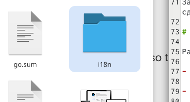{#fig:001 width=20%}

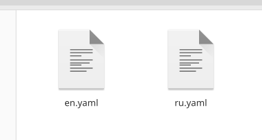{#fig:002 width=20%}

##

2. Для удобства создаю в папке *content* две папки, в которых будут храниться все файлы на разных языках.

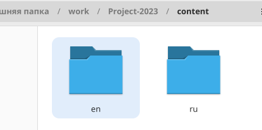{#fig:003 width=20%}

##

3. Затем в папке config -> _default -> languages добавляем русский язык. Проверяем изменения на сайте 

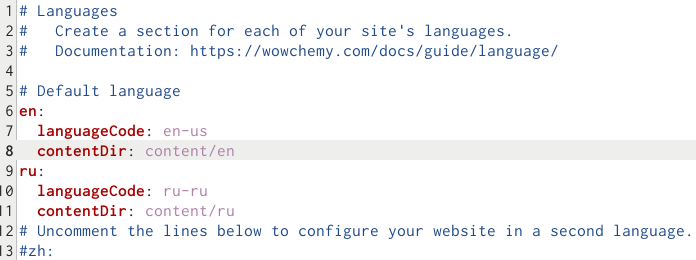{#fig:004 width=20%}

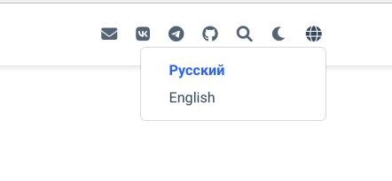{#fig:005 width=50%}

##

4. Далее делаем перевод всех постов. Вот примеры некоторых. 

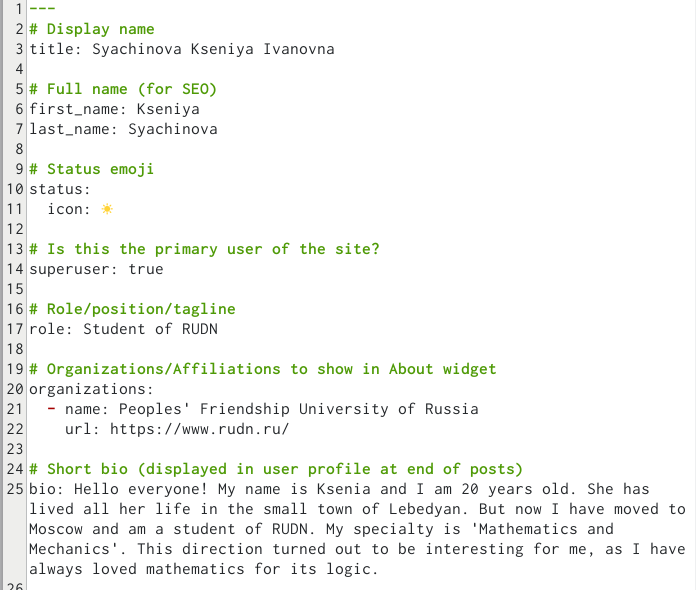{#fig:006 width=20%}

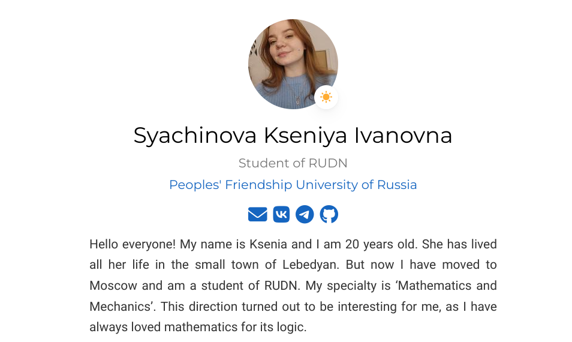{#fig:007 width=20%}

##

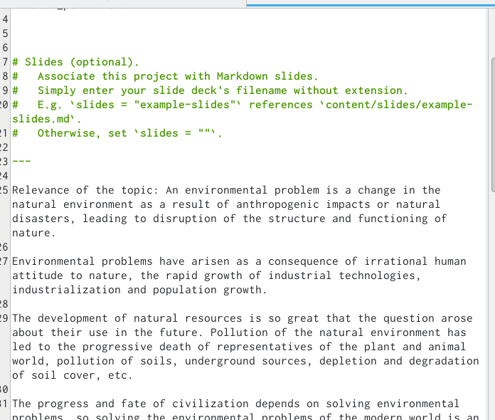{#fig:008 width=20%}

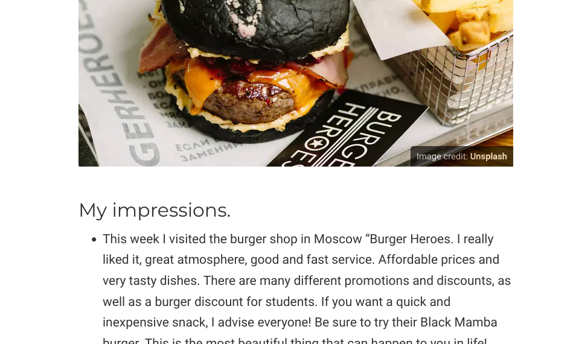{#fig:009 width=20%}

##

5. Для перевода меню в папке config делаем новый документ с русским языком

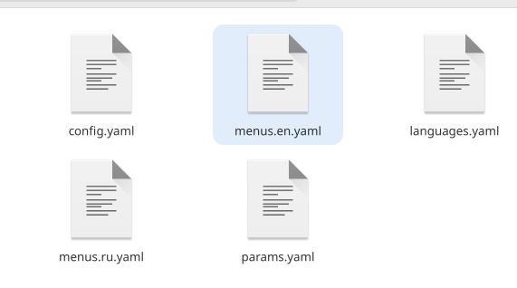{#fig:010 width=20%}

##

6. Сделаем пост недели и пост по теме. Также переведём их на другой язык

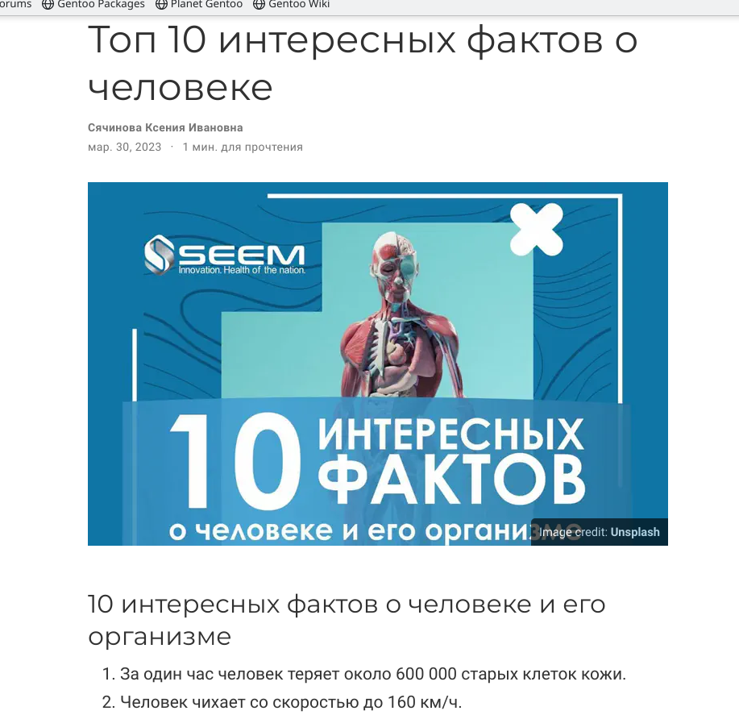{#fig:011 width=20%}

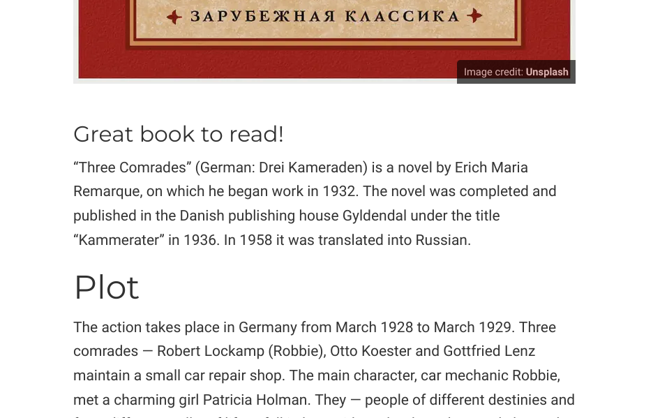{#fig:012 width=20%}

##

7. Затем выгружаем все материалы на сайт. Для этого делаем команды из publica и из папки нашего проекта!

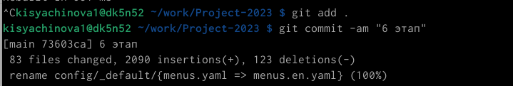{#fig:013 width=30%}

# Выводы

В процессе выполнения я приобрела практические навыки по созданию сайта, закончила создание сайта.
